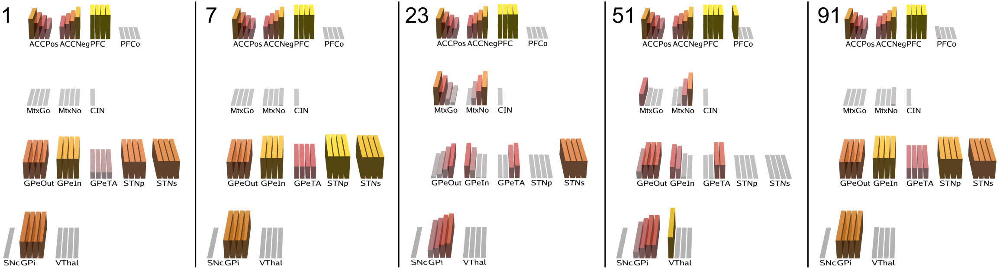

# PCore BG Model: Pallidal Core model of BG

The core of this model is the Globus Pallidus (external segment), GPe, which plays a central role in integrating Go and NoGo signals from the striatum, in contrast to the standard, "classical" framework which focuses on the GPi or SNr as the primary locus of integration.

Files: pcore_{[net.go](axon/pcore_net.go), [layers.go](axon/pcore_layers.go), [paths.go](axon/pcore_paths.go)}

There are two recently identified revisions to the standard circuitry diagram that drive this model [(Suryanarayana et al, 2019; others)](#references):

* A distinction between outer (GPeOut) and inner (GPeIn) layers of the GPe, with both D1-dominant (Go) and D2-dominant (NoGo / No) pathways into the GPe (the classical "direct" vs. "indirect" terminology thus not being quite as applicable).

* And a third, even more distinct Type A or arkypallidal layer (GPeTA).

Thus, the GPe circuitry is clearly capable of doing significant additional computation within this more elaborate circuitry, and it has also long been recognized as strongly interconnected with the subthalamic nucleus (STN), providing a critical additional dynamic.  This model provides a clear computational function for the GPe / STN complex within the larger BG system, with the following properties:

* GPeIn is the core of the core: it integrates Go and No striatal signals in consistent terms, with direct No inhibitory inputs, and indirect Go net excitatory inputs, inverted by way of double-inhibition through the GPeOut.  By having both of these signals converging on single neurons, the GPeIn can directly weigh the balance for and against a potential action.  Thus, in many ways, GPeIn is like the GPi / SNr of the classical model, except with the sign reversed (i.e., it is more active for a more net-Go balance).

* The GPeIn then projects inhibition to the GPeTA, which in turn drives the strongest source of broad, diffuse inhibition to the striatum: this provides the long-sought winner-take-all (WTA) action selection dynamic in the BG circuitry, by broadcasting back an effective inhibitory threshold that only the most strongly activated striatal neurons can withstand.  In addition, the GPeTA sends a weaker inhibitory pathway into the striatum, and having both of these is essential to prevent strong oscillatory dynamics.

* The GPi integrates the direct Go inhibition from the striatum, and the integrated Go vs. No balance from the GPeIn, which have the same sign and contribute synergistically to the GPi's release of inhibition on the thalamus, as in the standard model.  In our model, the integrated GPeIn input is stronger than the one from striatum Go pathway.

* The STN in our model plays two distinct functional roles, across two subtypes of neurons, defined in terms of differential connectivity patterns, which are known have the relevant diversity of connectivity (cites):

    + The `STNp` (pausing) neurons receive strong excitatory connections from the frontal cortex, and project to GPe (In and Out), while also receiving GPe inhibition.  The frontal input triggers a rapid inhibitory oscillation through the GPe circuits, which project strong inhibition in return to the STN's strong excitation.  This dynamic then produces a sustained inhibition of STNp firing, due to calcium-gated potassium channels (KCA, cites), which has been well documented in a range of preparations including, critically, awake-behaving animals (*in activo*) [(Fujimoto & Kita, 1993; Magill et al., 2004)](#references).  The net effect of this burst / pause is to excite the GPe and then open up a window of time when it can then be free from driving STN inputs, to integrate the balance of Go vs. No pathways.  We see in our model that this produces a nice graded settling process over time within the pallidal core, such that the overall gating output reaction time (RT) reflects the degree of Go vs. No conflict: high conflict cases are significantly slower than unopposed Go cases, whilst the strength of Go overall also modulates RT (stronger Go = faster RT).

    + The `STNs` (stopping) neurons receive weaker excitatory inputs from frontal cortex, and project more to the GPi / SNr compared to GPe.  These neurons do not trigger the activation required for strong levels of KCa channel opening, and instead experience a more gradual activation of KCa due to Ca influx over a more prolonged wave of activation.  Functionally, they are critical for stopping premature expression of the BG output through the GPi, before the core GPe integration has had a chance to unfold.  In this way, the STNs population functions like the more traditional view of STN overall, as a kind of global NoGo signal to prevent BG firing from being too "impulsive" ([Frank, 2006](#references)).  However, in this model, it is the GPe Go vs. No balancing that provides the more "considered", slower calculation, whereas the frontal cortex is assumed to play this role in the standard account.

* Both STN pathways recover from the KCa inhibition while inactivated, and their resumed activity excites the GP areas, terminating the window when the BG can functionally gate.  Furthermore, it is important for the STN neurons to experience a period with no driving frontal inputs, to reset the KCa channels to be able to support the STNp burst / pausing dynamics.  This has the desirable functional consequence of preventing any sustained frontal patterns from driving repeated BG gating of the same pathways again and again.  This provides a beneficial bias to keep the flow of action and cognition in a constant state of flux.

In summary, the GPe is the core integrator of the BG circuit, while the STN orchestrates the timing, opening the window for integration and preventing premature output.  The striatum is thus free to play its traditional role of learning to identify critical features supporting Go vs. No action weights, under the influence of phasic dopamine signals.  Because it is by far the largest BG structure, it is not well suited for WTA competition among alternative possible courses of action, or for integration between Go and No, which instead are much better supported by the compact and well-connected GPe core.

# Dynamics

The above figure shows the key stages unfolding over cycles within a standard Alpha cycle of 100 cycles.  Some of the time constants have been sped up to ensure everything occurs within this timeframe -- it may take longer in the real system.

* Cycle 1: tonic activation of GP and STN, just at onset of cortical inputs.  GPeTA is largely inhibited by GPeIn, consistent with neural recording.

* Cycle 7: STNp peaks at above the .9 threshold where KCa triggers pausing, while STNs rises more slowly, driving a slower accumulation of KCa.  STN has activated the GPe layers.

* Cycle 23: Pause of STNp enables GPe layers to settle into integration of MtxGo and MtxNo activations.  GPeTA sends broad inhibition to Matrix, such that only strongest are able to stay active.

* Cycle 51: STNs succumbs to slow accumulation of KCa, allowing full inhibition of GPi output from remaining MtxGo and GPeIn activity, disinhibiting the ventral thalamus (VThal), which then has a excitatory loop through PFCo output layers.

* Cycle 91: STN layers regain activation, resetting the circuit.  If PFC inputs do not turn off, the system will not re-gate, because the KCa channels are not fully reset.

The above figure shows the reaction time (cycles) to activate the thalamus above a firing threshold of .5, for a full sweep of ACC positive and negative values, which preferentially activate Go and No respectively.  The positive values are incremented by .1 in an outer loop, while the negative values are incremented by .1 within each level of positive.  Thus, you can see that as NoGo gets stronger, it competes against Go, causing an increase in reaction time, followed by a failure to activate at all.

# Electrophysiological data

Recent data: a majority of STN units show decreasing ramp prior to go cue, then small subset show brief phasic burst at Go then brief inhib window then *strong sustained activity* during / after movement.  This sustained activity will turn off gating window -- gating in PFCd can presumably do that and provide the final termination of the gating event.

**Figure:** Fujimoto & Kita, 1993, figure 3

**Figure:** STN recordings from Mizraei et al, 2017

Data from [Dodson et al, 2015](#references) and [Mirzaei et al, 2017](#references) shows brief increase then dips or increases in activity in GPe prototypical neurons, with also very consistent data about brief burst then shutoff in TA neurons.  So both outer and inner GPe prototypical neuron profiles can be found.

**Figure:** GPe recordings around movement from Dodson et al, 2015

## STNp pause mechanisms: SKCa channels

The small-conductance calcium-activated potassium channel (SKCa) is widely distributed throughout the brain, and in general plays a role in medium-term and slow after-hyper-polarization (mAHP, sAHP) [(Dwivedi & Bhalla, 2021; Adelman et al, 2012)](#references), including most dramatically the full *pausing* of neural firing as observed in the STNp neurons.  Ca activation enables these channels to be sensitive to longer-term dynamics than voltage or sodium gated ones.  The direct Ca gating dynamics in SKCa (5-15 msec activation, ~30 msec deactivation) are _not_ sufficient to explain longer term pausing (mAHP, sAHP), so we need to include additional intracellular Ca dynamics.

Specifically, SKCa can be activated by intracellular stores, which require inactivity to recharge the Ca available for release. These intracellular stores can release quickly, have a slow decay once released, and the stores can take a while to rebuild, leading to rapidly triggered, long-lasting pauses that don't recur until stores have rebuilt, which is the observed pattern of firing of STNp pausing neurons, that open up a window for BG gating.  Also, STN can be ACh modulated so neurons are tonically inhibited until ACh bursts disinhibit and allow for gating (just set `NeuroMod.AChDisinhib` to ~2).  See [chans README](chans/README.md#calcium-gated-potassium-channels:-sk-and-bk) for more details.

One critical behavior is the ability of SKCa channels to drive a strong _novelty sensitivity_ for STNp pausing, which requires a topographic coordination between STNp and direct striatum PFC pathways to work effectively.  Specifically, the need for inactivity for intracellular Ca stores to be rebuilt means that any sustained STNp activity from a continued PFC input will fail to open the gating window.  Only once a given STNp is inactive for a period of time longer than the ~200 msec pausing window can it recharge.  But to open a gating window, a sufficiently large number of STNp neurons must pause, so a topographic organization would allow for different populations to pause at different points in time, while sustained activity among a specific set of PFC neurons would not open the gating window.

The [boa](examples/boa) model for example can support this topographic organization according to different BLA / US domains, such that different STNp pools receive from different BLA / OFC US groups.

# Learning logic

Medium spiny neurons (MSNs) make up the great majority of neurons in the striatum. The core learning principle for MSNs is the standard 3-factor rule involving dopamine and the activity of the sending and receiving neurons, qualitatively:

* `dwt = da * sn.Act * rn.Act`

where the `da` factor reflects the level of dopamine, signed for burst (+) vs dips (-), and includes a sign reversal for D2 vs. D1 neurons (handled by the `RLRate` factor in axon).

The key challenge in BG learning is that the `da` term typically comes significantly later in time relative to the actual gating that gave rise to the relevant reward outcome -- i.e., the _temporal credit assignment_ problem.  We adopt a trace-based solution, where the hebbian-like gating activity factors accumulate on each trial into a trace variable:

* `Tr += sn.Act * rn.Act`

(we actually use `sn.CaSpkD` and `rn.GeIntMax` which are spiking Ca variables, and GeIntMax captures the max activity over the trial because MSN firing is transient).

And then we leverage the _reward salience_ firing properties of cholinergic interneurons (CINs, AKA TANs = tonically active neurons) to provide a later "learn now" signal by firing in proportion to the non-discounted, positive rectified US or CS value (i.e., whenever any kind of reward or punishment signal arrives, or is indicated by a CS).  Thus, at the point of high ACh firing, which coincides with DA release, we get:

* `dW += da * Tr`

and the trace is effectively reset by a decay factor:

* `Tr -= ACh * Tr`

One further wrinkle is that the BG will become permanently stuck if there is no gating at all -- trial and error learning requires "trials" of activity to learn!  Thus, we introduce a slow "NoGate" learning case on trials where no neurons gated within the layer:

* `Tr += -NoGateLRate * ACh * rn.SpkMax * sn.CaSpkD`

# Other models

* **SuryanarayanaHellgrenKotaleskiGrillnerEtAl19** -- focuses mainly on WTA dynamics and doesn't address in conceptual terms the dynamic unfolding.

# References

* Adelman, J. P., Maylie, J., & Sah, P. (2012). Small-conductance Ca2+-activated K+ channels: Form and function. Annual Review of Physiology, 74, 245–269. https://doi.org/10.1146/annurev-physiol-020911-153336

* Bogacz, R., Moraud, E. M., Abdi, A., Magill, P. J., & Baufreton, J. (2016). Properties of neurons in external globus pallidus can support optimal action selection. PLoS computational biology, 12(7).
    + lots of discussion, good data, but not same model for sure.

* Dodson PD, Larvin JT, Duffell JM, Garas FN, Doig NM, Kessaris N, Duguid IC, Bogacz R, Butt SJ, Magill PJ. Distinct Developmental Origins Manifest in the Specialized Encoding of Movement by Adult Neurons of the External Globus Pallidus. Neuron. 2015; 86:501–513. [PubMed: 25843402]

* Dunovan, K., Lynch, B., Molesworth, T., & Verstynen, T. (2015). Competing basal ganglia pathways determine the difference between stopping and deciding not to go. Elife, 4, e08723.
    + good ref for Hanks -- DDM etc

* Frank, M. J. (2006). Hold your horses: A dynamic computational role for the subthalamic nucleus in decision making. Neural Networks, 19(8), 1120–1136. http://www.ncbi.nlm.nih.gov/pubmed/16945502

* Fujimoto, K., & Kita, H. (1993). Response characteristics of subthalamic neurons to the stimulation of the sensorimotor cortex in the rat. Brain Research, 609(1–2), 185–192. http://www.ncbi.nlm.nih.gov/pubmed/8508302

* Hegeman, D. J., Hong, E. S., Hernández, V. M., & Chan, C. S. (2016). The external globus pallidus: progress and perspectives. European Journal of Neuroscience, 43(10), 1239-1265.

* Magill, P. J., Sharott, A., Bevan, M. D., Brown, P., & Bolam, J. P. (2004). Synchronous unit activity and local field potentials evoked in the subthalamic nucleus by cortical stimulation. Journal of Neurophysiology, 92(2), 700–714. http://www.ncbi.nlm.nih.gov/pubmed/15044518

* Mirzaei, A., Kumar, A., Leventhal, D., Mallet, N., Aertsen, A., Berke, J., & Schmidt, R. (2017). Sensorimotor processing in the basal ganglia leads to transient beta oscillations during behavior. Journal of Neuroscience, 37(46), 11220-11232.
    + great data on STN etc

* Suryanarayana, S. M., Hellgren Kotaleski, J., Grillner, S., & Gurney, K. N. (2019). Roles for globus pallidus externa revealed in a computational model of action selection in the basal ganglia. Neural Networks, 109, 113–136. https://doi.org/10.1016/j.neunet.2018.10.003
    + key modeling paper with lots of refs

* Wei, W., & Wang, X. J. (2016). Inhibitory control in the cortico-basal ganglia-thalamocortical loop: complex regulation and interplay with memory and decision processes. Neuron, 92(5), 1093-1105.
    + simple model of SSRT -- good point of comparison

    
