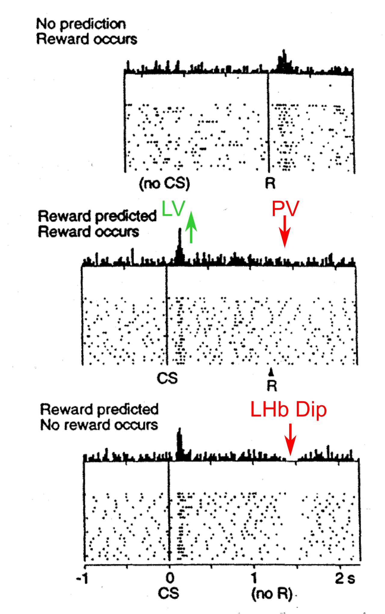

# PVLV: Primary Value, Learned Value

This is a ground-up rewrite of PVLV [Mollick et al, 2020](#references) for Axon, designed to capture the essential properties of the [Go leabra version](https://github.com/emer/leabra/tree/master/pvlv) in a yet simpler and cleaner way without the extensive modulatory dynamics present in the Leabra model. Thus, these can be used in a more mix-and-match manner (e.g., the BLA can be used to train OFC, independent of its phasic dopamine role).

Files: pvlv_{[net.go](axon/pvlv_net.go), [layers.go](axon/pvlv_layers.go), [prjns.go](axon/pvlv_prjns.go)}.  Example: [pvlv](examples/pvlv).

# Introduction



**Figure 1:** PV and LV in the PVLV model: LV = Learned Value (Amygdala), which learns the value of conditioned stimuli (CSs). PV = Primary Value (Ventral Striatum, principally the Nucleus Accumbens Core, NAc), which learns to expect US (unconditioned stimuli, rewards) and shunt dopamine when they occur, or, when omitted, the LHb (lateral habenula) drives a dip / pause in DA firing.  Data from Schultz et al (1997) of VTA firing in a Pavlovian conditioning paradigm.

There are many brain areas involved in controlling the phasic firing of dopamine cells in the VTA (ventral tegmental area) and SNc (substantia nigra, pars reticulata). The PVLV model integrates contributions from the most important of these areas within a coherent overall computational framework including: 1) multiple sub-regions of the amygdala, an area long implicated in affective processing of both positive and negative emotion; 2) multiple pathways within the ventral striatum (VS, which includes the nucleus accumbens, NAc), also important in many aspects of emotional expression; and, 3) the lateral habenula (LHb) pathway, recently identified as the substrate responsible for the inhibitory pausing (dipping) of dopamine neuron activity [Matsumoto & Hikosaka, 2007; Matsumoto & Hikosaka, 2009](#references).

The basic functions of the model can be seen in Pavlovian conditioning:

* Initially neutral cues (**conditioned stimuli; CSs**) are paired with rewards or punishments (**unconditioned stimuli; USs**), resulting in the acquisition of conditioned associations between CS -> US.

* Critically, phasic dopamine responses that initially occur for unexpected USs come to occur at the time of the CS instead.

PVLV models the neurobiological mechanisms that cause this change in dopamine signaling to occur.  The overarching idea behind the PVLV model [OReilly et al, 2007](#references) is that there are two separate brain systems underlying two separate aspects of reward learning:

* The **Primary Value (PV)** (US outcome predicting) and **Learned Value (LV)** (CS predictive cue learning) systems.

* **PV = ventral striatum**, which learns to expect US outcomes and causes the phasic dopamine signal to reflect the difference between this expectation and the actual US outcome value experienced. This difference is termed a *reward prediction error* or *RPE*.

* **LV = amygdala**, which learns to associate CSs with US outcomes (rewards and punishments), thus acquiring new CS-outcome value associations (learned value).

This division of labor is consistent with a considerable amount of data [Hazy et al, 2010](#references). The 2020 PVLV model has a greatly elaborated representation of the amygdala and ventral striatal circuitry, including explicitly separate pathways for appetitive vs. aversive processing, as well as incorporating a central role for the *lateral habenula* (LHb) in driving pauses in dopamine cell firing (dipping) for worse than expected outcomes. Figure 1 provides a big-picture overview of the model.


**Figure 2:** Simplified diagram of major components of the PVLV model, with the LV Learned Value component in the Amygdala and PV Primary Value component in the Ventral Striatum (principally the Nucleus Accumbens Core, NAc).  LHb: Lateral Habenula, RMTg: RostroMedial Tegmentum, PPTg: PendunculoPontine Tegmentum, LHA: Lateral Hypothalamus, PBN: Parabrachial Nucleus. See [PVLV Code](https://github.com/emer/leabra/tree/master/pvlv) for a more detailed figure and description of the implementation.

Note that we use anatomical labels for computationally-specified functions consistent with our theory, without continually reminding the reader that of course this is all a simplified theory for what these brain areas area actually doing.  If it is useful for you, just imagine we said "we hypothesize that the function of area X is.." everywhere.

# A Central Challenge: Learning *Something* when *Nothing* happens

As articulated in the PVLV papers, a central challenge that any RL model must solve is to make learning dependent on expectations such that the *absence* of an expected outcome can serve as a learning event, with the appropriate effects.  This is critical for **extinction** learning, when an expected reward outcome no longer occurs, and the system must learn to no longer have this expectation of reward.  This issue is particularly challenging for PVLV because extinction learning involves different pathways than initial acquisition (e.g., BLA Ext vs. Acq layers, VSPatch, and the LHb dipping), so indirect effects of expectation are required.

Furthermore, in the context of the full BG / OFC / ACC ([BOA](examples/boa/README.md)) goal-directed framework (i.e., the *Rubicon* model), an extinction event is equivalent to *goal failure* -- the expected outcome did not occur.  Thus, it is associated with the deactivation of any maintained goal state, and any additional cost associated with failure (at least the effort expended so far).  In this context, it is also possible (likely?) that outcome expectations in a simple Pavlovian context could be dissociable from a full goal-engagement state, involving only the OFC-specific portion of the full goal-engaged activity state.

In the 2020 version of PVLV, activation of the BLA by a CS, and subsequent activity of the external USTime input layer, represented the expectation and provided the *modulatory* activity on BLAExt and VSPatch to enable extinction learning conditioned on expectations.  The model relied heavily on these modulatory and externally-generated representations -- the current Axon version takes the next step in implementing these in a more realistic and robust manner.

In the current version, the gated goal engaged state, corresponding to *OFC PT layer sustained activity*, is the key neural indicator of an active expectation.  Thus, we need to ensure that the model exhibits proper CS-driven BG (VP) gating of active maintenance in OFC PT, and that this maintained activity is available at the right time (and not the wrong time), and in the right form, to drive extinction learning in the right way.  Thus, the PT layers are the core "backbone" of the model, bridging between the LV and PV sides.

The key logic for extinction (in a positive valence context), and related RPE (reward prediction error) expectation-dependent dynamics of DA bursting, is that the `VSPatch` layer (called `PVi` = Primary Value inhibition in earlier PVLV models) learns to expect when a primary value (PV) US (unconditioned stimulus) outcome occurs, and it drives both shunting inhibition to the VTA (to reduce firing when the US does occur) and also dipping via the LHb when the US does not occur.

# LHb: The Brain's Extinguisher

The LHb (lateral habenula) turns an expected (via VSPatch inputs) but absent US non-event into a full-fledged active neural signal, which drives three distinct outputs:

* **DA dipping**: The combination of an active VSPatch input signaling the expectation of a US at the current point in time, with no bottom-up actual US receipt (e.g., via hypothalamic inputs), results in activity of a subset of LHb neurons, which then drive dipping (pausing) of DA tonic activity (via the inhibition provided by the RMTg).  This phasic dip in DA activity shifts the balance from D1 to D2 in all DA-recipient neurons in the BG and BLA, causing learning to start to expect this absence (see below on BLA Ext pathway).

* **OFC / goal gating off**: the LHb dip activation is summed over trials, and when it reaches a threshold level, the system effectively "gives up" on the current US expectation.  This amounts to deactivating any existing goal state (i.e., the OFC maintained activity in this model), and in the goal-driven learning framework (BOA), it also entails "paying the cost" of accumulated effort toward the goal (i.e., extra negative US / DA dipping -- gets applied to the first USneg value), which may be associated with the subjective sense of "disappointment".  Biologically, this is thought to occur via MD thalamic projections to OFC, ACC, dlPFC areas, which are the same pathways activated when an actual US is received and likewise deactivates these areas.  Implementationally, it happens simply by setting the `HasRew` flag in the `Context.NeuroMod` structure, which triggers decay of the relevant PFC areas (via the `Act.Decay.OnRew` flag).  This happens at the end of the Minus Phase.

* **ACh signaling**: ACh is released for any reward-salient event, basically CS onset (via PPTg) and US onset) and it modulates learning and activity in the BLA and VS.  The LHb projections to the basal forebrain cholinergic system allow it to provide the key missing piece of ACh signaling for the absence of an expected US, so that a consistent framework of ACh neuromodulation can apply for all of these cases.

Taken together, these key functions provide a compelling computational role for why the brain has a separate neural system for recognizing the absence of an expected US.  In the mathematics of the temporal-difference (TD) equations, a negative TD signal associated with a missing expected reward is no different than the reduction associated with the prediction of a reward that does occur, but the brain treats these two very differently.  The VSPatch provides a shunting-only effect directly to the VTA to reduce dopamine firing for expected rewards (USs) that occur, but the LHb is a special system for the case where USs fail to occur.

# PT (Pyramidal Tract) Sustained and Dynamic Goal Maintenance

Pyramidal tract (PT) neurons in layer 5 of each PFC area provide the robust active maintenance of goal state over time, serving as a sustained *bridge* between the initiation of the goal at the time of the CS to the time of the US.  These are interconnected with the MD thalamus (and other thalamic areas such as VM = ventromedial, VA = ventral anterior, VL = ventral lateral) and are the primary output neurons of the cortex.  In M1 (primary motor cortex), these are the neurons that project to the spinal cord muscle outputs and actually drive motor behavior.  The thalamic connections are "side branches" of these descending subcortical pathways.  See [Guo et al. (2018)](#references).  There is a large diversity of PT neuron "subtypes" with different temporal and content-based response properties -- we are only implementing the subset of active maintenance (working memory) PT neurons.

The BG (ventral striatum (VS) & ventral pallidum (VP) drives disinhibitory gating of active maintenance in the PT layers, consistent with the longstanding ideas in the PBWM (Prefrontal-cortex, Basal-ganglia Working Memory) framework and recent updates thereof.  The following are specific issues that need to be resolved in the implementation to make everything work properly in the PVLV context.

## Time of learning vs. gating issues

Gating happens within the CS-onset theta cycle, driven by direct BLA recognition of the CS and corresponding PPTg temporal-derivative activity that drives ACh, which disinhibits the BG.  This results in an activated OFC PT layer by the end of the trial.  This is problematic in the PVLV context, because the active PT layer will drive activity and learning in the VSPatch layer consistent with the goal engaged state.  In the 2020 PVLV model, the USTime input was programmed to activate only on the post-CS trial.

## Time / context specificity of PT activity vs. Stable maintenance

There is a basic tension in PT maintained activity, which can be resolved by having two different PT layer types.  On the one hand, PT needs to maintain a stable representation of the stimulus and other context present at the time of initial goal activation (gating), so that learning can properly bridge across the full time window between the initial gating and final outcome.  On the other hand, prediction of specific events within the goal-engaged window, and especially the prediction of when the goal will be achieved, requires a continuously-updating dynamic representation, like that provided by the CT layer, which is specifically driven by predictive learning of state as it updates across time.  However, the CT layer is always active, and thus does not strongly distinguish the critical difference between goal engaged vs. not.  Furthermore, anatomically, CT only projects to the thalamus and does not have the broad broadcasting ability of the PT layer.  Electrophysiologically, there is plenty of evidence for both sustained and dynamically updating PT activity.  As usual, these are not strongly segregated anatomically, but we use different layers in the model to make the connectivity and parameterization simpler.

A reasonable solution to this situation is to add a new PT layer type, `PTPredLayer`, that represents the integration of PT stable maintenance and CT dynamic updating.  This layer type receives a temporally-delayed `CTCtxtPrjn` from the corresponding `PTMaintLayer`, which also solves the timing issue above, because the temporal delay prevents activity during the CS gating trial itself.  The PTPred layer is parameterized to not have strong active maintenance NMDA currents, and to track and help predict the relevant dynamic variables (time, effort etc).

## Extinction learning and goal inactivation

As noted above, the LHb will drive deactivation of the PT active maintenance layer, signaling that the expected US outcome was not achieved.  Because the PT drives input into the VSPatch expectation layer, it then no longer signals the expectation.  Thus, it is important for both the goal-driven and pavlovian paradigms to deactivate the PT maintenance at this point.

# BLA: Basolateral Amygdala

The basolateral amygdala learns to associate an initially neutral CS with the US that it is reliably associated with.  This learning provides a key step in enabling the system to later recognize the CS as a "trigger" opportunity to obtain its associated US -- if that US is consistent with the current Drive state (e.g., the CS is associated with food and the system is "hungry"), then it should engage a goal to obtain the US.  In the classical conditioning paradigm pioneered by Pavlov, the CS was a bell and the US was food.  The BLA learns the link between the bell and the food, effectively "translating" the meaning of the CS into pre-existing pathways in the brain that process different USs, thus causing Pavlov's dogs to salivate upon hearing the tone. 

The BLA learns at the time of the US, in response to dopamine and ACh (see below), so any stimulus or memory representation reliably present just before the onset of the US is then mapped onto the corresponding US-specific Pool in the BLA layer.  `BLAPosAcqD1` is the positive-valence *acquisition* layer expressing more D1 dopamine receptors, and it is opposed (inhibited) by a corresponding `BLAPosExtD2` D2-dominant *extinction* layer.  The PVLV model of [Mollick et al. (2020)](https://ccnlab.org/papers/MollickHazyKruegerEtAl20.pdf) describes all of this in great detail. 

There are 2x2 BLA types: Positive or Negative valence US's with Acquisition vs. Extinction:

* `BLAPosAcqD1` = Positive valence, Aquisition
* `BLAPosExtD2` = Positive valence, Extinction
* `BLANegAcqD2` = Negative valence, Acquisition
* `BLANegAcqD1` = Negative valence, Extinction

The D1 / D2 flips the sign of the influence of DA on the activation and sign of learning of the BLA neuron (D1 = excitatory, D2 = inhibitory).

The learning rule for PosAcqD1 is:

* `DWt = lr * DALr * Send_prv * |CaSpkP - SpkPrv|_+`
    + `CaSpkP`: receiver current trial plus phase Ca -- also has DA modulation reflected in a D1 / D2 direction.
    + `SpkPrv`: receiver CaSpkP from the previous ThetaCycle (trial).  Thus, as in the Leabra PVLV, the outcome / US is compared to the prior t-1 trial.  This difference is positively-rectified: negative deltas are 0.
    + `Send_prv`: is the sending activity from *previous* trial -- this is also integrated over time in the `Tr` trace variable (can accumulate eligibility trace if Tau > 1).
    + `DALr`: is the DA modulation of learning rate, implemented via `RLrate` factor via `Learn.NeuroMod` params.  This includes the `Diff` lrate factor as in standard axon, which is likewise based on the between-trial diff as opposed to the plus - minus phase differences.
    + `[ ]_+` indicates the positive rectification of the delta -- there is a `BLAAcq.NegDeltaLRate` parameter that applies when this delta is negative -- typically .01, producing a very slow decrease relative to increase.

The key logic for using the t-1 to t delta is that it self-limits the learning once BLA neurons start coming on for the CS -- initially they are activated by the US directly, so the delta occurs at the US trial, but after sufficient learning, BLA neurons activate at the CS and remain active during the intervening trial, so that there is no longer a delta at the US.
    
## Extinction learning

The `BLAPosExtD2` extinction layer provides the "context specific override" of the acquisition learning in `BLAPosAcqD1`, which itself only unlearns very slowly if at all.  It achieves this override in 3 different ways:

* **Direct inhibition** of corresponding BLA Acq neurons in the same US pool.  This is via a projection with the `BLAExtToAcq` class, and setting the `Prjn.PrjnScale.Abs` value of this projection controls the strength of this inhibition.

* **Opposing at CeM** -- the central nucleus layer, `CeMPos`, combines excitation from Acq and inhibition from Ext, and then drives the PPTg -- so when Ext is active, CeM gets less active and PPTg can fail to drive ACh modulation of gating.

* **VS NoGo** -- Ext projects to the ventral striatum / ventral pallidum (Vp) NoGo layer and can oppose gating directly there.

A key challenge here is to coordinate these two layers with respect to the US expectation that is being extinguished.  In the Leabra PVLV version a modulatory projection from Acq to Ext served this function.

In this model, we instead leverage the OFC PT active maintenance to select the US that is being expected, as a consequence of BLA Acq triggering active maintenance gating of the specific expected US outcome, which then projects into BLA Ext.  The learning rule for Ext is not based on a delta rule, and instead is a straightforward DA D2-modulated associative learning rule:

* `DWt = lr * DALr * Send_prv * (CaSpkP / Max)`

Where `DALr` is *positive* when DA is negative, due to the D2 sign reversal, and the receiving activity is normalized by the Max layer activity, because it often starts out only very weakly active.  There is no meaningful delta here so it just keeps learning until the BLA Acq is extinguished to the point where it no longer can drive gating of OFC PT in the first place, breaking the learning cycle.

Also, it is important that the stable `PTMaint` layer drives the BLA Ext input, not the dynamically changing `PTPred`, because BLA Ext learns at the time when the US was expected, but it must then get activated earlier at the time of CS onset to block the BLA Acq gating.
      
# CeM -> PPTg -> ACh

This pathway drives acetylcholine (ACh) release in response to *changes* in BLA activity from one trial step to the next, so that ACh can provide a phasic signal reflecting the onset of a *new* CS or US, consistent with available data about firing of neurons in the nucleus basalis and CIN (cholinergic interneurons) in the BG [(Sturgill et al., 2020)](#references).  This ACh signal modulates activity in the BG, so gating is restricted to these time points.  The `CeM` (central nucleus of the amygdala) provides a summary readout of the BLA activity levels, as the difference between the `Acq - Ext` activity, representing the overall CS activity strength.  This goes to the `PPTg` (pedunculopontine tegmental nucleus) which computes a temporal derivative of its CeM input, which then drives phasic DA (dopamine, in VTA and SNc anatomically) and ACh, as described in the PVLV model [(Mollick et al., 2020)](#references).

## CeM

For now, CeM is only serving as an integration of BLA `Acq` and `Ext` inputs, representing the balance between them.  This uses non-learning projections and mostly CeM is redundant with BLA anyway.  This also elides the function CeL.
    
## PPTg

The PPTg layer computes the temporal derivative of the CeM inputs, based on the strength of feedforward inhibition on the previous ThetaCycle (trial) vs. the current one.  The strength of this factor is in this parameter:
```
"Layer.Inhib.Pool.FFPrv":     "10",
```

# VSPatch

The ventral striatum (VS) patch neurons functionally provide the discounting of primary reward outcomes based on learned predictions, comprising the PV = primary value component of the PVLV algorithm.

This model greatly simplifies the VSPatch by only having a single layer for positive valence, D1 receptor, instead of the opposing D1 vs. D2 for both positive and negative valence.  The omission of negative valence is reasonable because it is unclear to what extent negative outcomes can be compensated for by learned expectations, and especially the extent to which there is a "relief burst" when an expected negative outcome does not occur.  The opposing D2 pathway for positive valence does not introduce any qualitatively new behavior and causes additional complexity in balancing the two pathways.

The learning rule here is a standard "3 factor" dopamine-modulated learning, very similar to the BLA Ext case, except operating at the current time step:

* `DWt = lr * DALr * Send_prv * (CaSpkP / Max)`

where `Max` again normalizes the receiving activity because VSPatch also can start out very weakly active.

# References

* Bouton, M. E. (2004). Context and behavioral processes in extinction. Learning & Memory, 11(5), 485–494. http://dx.doi.org/10.1101/lm.78804

* Brischoux, F., Chakraborty, S., Brierley, D. I., & Ungless, M. A. (2009). Phasic excitation of dopamine neurons in ventral {VTA} by noxious stimuli. Proceedings of the National Academy of Sciences USA, 106(12), 4894–4899. http://www.ncbi.nlm.nih.gov/pubmed/19261850

* Gerfen, C. R., & Surmeier, D. J. (2011). Modulation of striatal projection systems by dopamine. Annual Review of Neuroscience, 34, 441–466. http://www.ncbi.nlm.nih.gov/pubmed/21469956

* Guo, K., Yamawaki, N., Svoboda, K., & Shepherd, G. M. G. (2018). Anterolateral motor cortex connects with a medial subdivision of ventromedial thalamus through cell type-specific circuits, forming an excitatory thalamo-cortico-thalamic loop via layer 1 apical tuft dendrites of layer 5b pyramidal tract type neurons. Journal of Neuroscience, 38(41), 8787–8797. https://doi.org/10.1523/JNEUROSCI.1333-18.2018

* Hazy, T. E., Frank, M. J., & O’Reilly, R. C. (2010). Neural mechanisms of acquired phasic dopamine responses in learning. Neuroscience and Biobehavioral Reviews, 34(5), 701–720. http://www.ncbi.nlm.nih.gov/pubmed/19944716

* Herry, C., Ciocchi, S., Senn, V., Demmou, L., Müller, C., & Lüthi, A. (2008). Switching on and off fear by distinct neuronal circuits. Nature, 454(7204), 1–7. http://www.ncbi.nlm.nih.gov/pubmed/18615015

* Matsumoto, M., & Hikosaka, O. (2007). Lateral habenula as a source of negative reward signals in dopamine neurons. Nature, 447, 1111–1115. http://www.ncbi.nlm.nih.gov/pubmed/17522629

* Matsumoto, O., & Hikosaka, M. (2009). Representation of negative motivational value in the primate lateral habenula. Nature Neuroscience, 12(1), 77–84. http://www.citeulike.org/user/nishiokov/article/3823302

* McDannald, M. A., Lucantonio, F., Burke, K. A., Niv, Y., & Schoenbaum, G. (2011). Ventral striatum and orbitofrontal cortex are both required for model-based, but not model-free, reinforcement learning. The Journal of Neuroscience, 31(7), 2700–2705. https://doi.org/10.1523/JNEUROSCI.5499-10.2011

* Mollick, J. A., Hazy, T. E., Krueger, K. A., Nair, A., Mackie, P., Herd, S. A., & O'Reilly, R. C. (2020). A systems-neuroscience model of phasic dopamine. Psychological Review, 127(6), 972–1021. https://doi.org/10.1037/rev0000199.  [PDF]((https://ccnlab.org/papers/MollickHazyKruegerEtAl20.pdf)

* O’Reilly, R. C., Frank, M. J., Hazy, T. E., & Watz, B. (2007). PVLV: The primary value and learned value Pavlovian learning algorithm. Behavioral Neuroscience, 121(1), 31–49. http://www.ncbi.nlm.nih.gov/pubmed/17324049

* Tobler, P. N., Dickinson, A., & Schultz, W. (2003). Coding of predicted reward omission by dopamine neurons in a conditioned inhibition paradigm. Journal of Neuroscience, 23, 10402–10410. http://www.ncbi.nlm.nih.gov/pubmed/14614099

* Waelti, P., Dickinson, A., & Schultz, W. (2001). Dopamine responses comply with basic assumptions of formal learning theory. Nature, 412, 43–48. http://www.ncbi.nlm.nih.gov/pubmed/11452299


# TODO:

* multiplicative effort discounting will not produce a net negative on goal failure -- need an extra case for that.

* PT not clearing -- need to clear super too!

