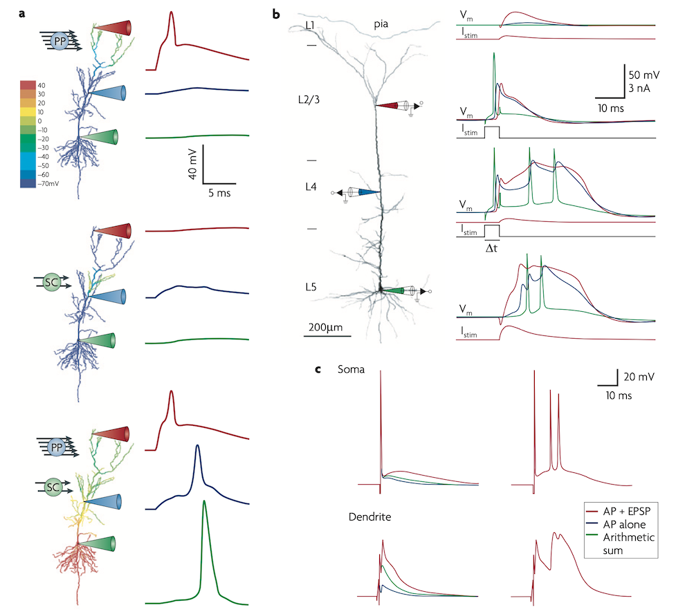
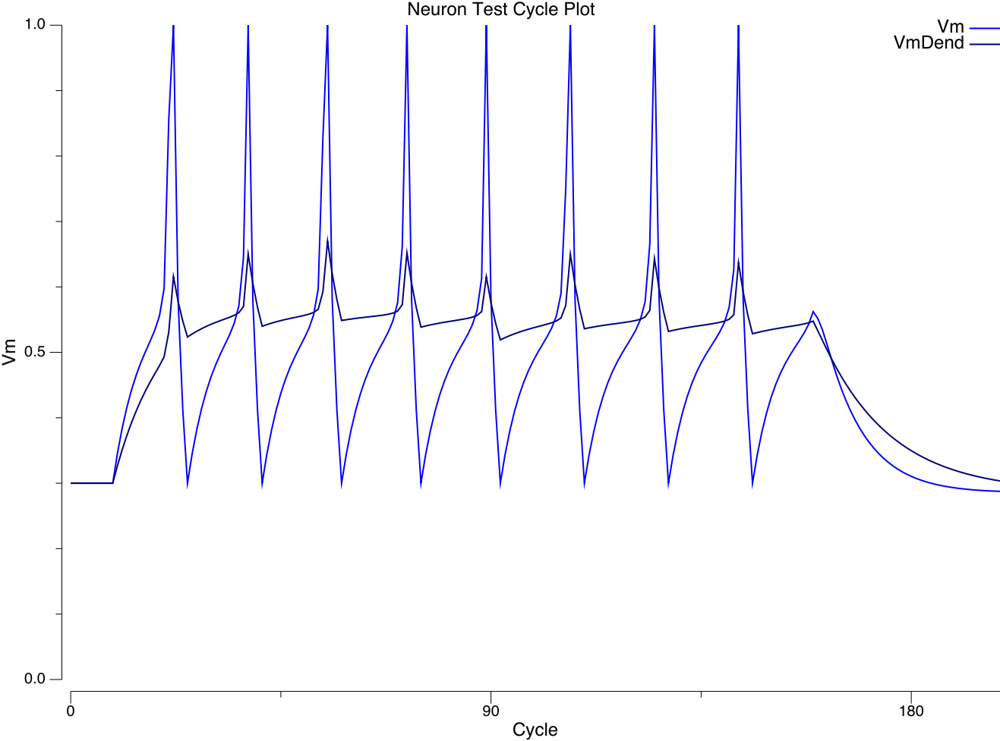

# Axon Neural Modeling Framework

[](https://goreportcard.com/report/github.com/emer/axon)
[](https://godoc.org/github.com/emer/axon)
[](https://codecov.io/gh/emer/axon)


This is the Go implementation of the Axon algorithm for spiking, biologically based models of cognition, based on the [emergent](https://github.com/emer/emergent) framework.  Development of Axon is supported by the Obelisk project at https://astera.org/ and by collaborations with scientists at the University of California Davis, and other institutions around the world.

Axon is the spiking version of [Leabra](https://github.com/emer/leabra), with several advances.  As a backcronym, *axon* could stand for *Adaptive eXcitation Of Noise*, reflecting the ability to learn using the power of error-backpropagation in the context of noisy spiking activation.  The spiking function of the axon is what was previously missing from Leabra.  Axon is used to develop large-scale systems-neuroscience models of the brain, i.e., [Computational Cognitive Neuroscience](compcogneuro.org), centered around the [Rubicon](Rubicon.md) model of goal-driven, motivated cognition.

Axon and emergent use the [Cogent Core](https://cogentcore.org/core) GUI framework.  See [install](https://www.cogentcore.org/core/setup/install) instructions there.  Once those prerequisites are in place, then the simplest way to run a simulation is:

```sh
$ core run [platform]
```

where `[platform]` is optional (defaults to your local system), and can include `android`, `ios` and `web`!

See the [ra25 example](examples/ra25/README.md) for a complete working example, which is intended to be a good starting point for creating your own models.  The [emergent wiki install](https://github.com/emer/emergent/wiki/Install) page has a tutorial for how to create your own simulation starting from the ra25 example.

# Current Status / News

* August 2024: **v2.0.0-dev-x.x.x**: in process transition to Cogent Core infrastructure, and major improvements in the [Rubicon](Rubicon.md) framework.  Also finally figured out how to avoid the computationally expensive integration of calcium at each individual synapse at a cycle-by-cycle level, using a reasonable linear model based on activity windows on the sending and receiving neuron, with multiplicative factors (r^2 is .96 at capturing the cycle-by-cycle values).  A full "2.0" release will be made once Cogent Core gets to a 1.0 stable release, and all the tests etc are updated.

* June 2023: **v1.8.0** Neuron and Synapse memory now accessed via methods with arbitrary strides so GPU and CPU can each have optimal memory ordering -- NVIDIA A100 performance now comparable to Mac M1, which also improved by 25%.  Includes data parallel processing (multiple input patterns processed in parallel using shared weights) which makes GPU faster than CPU even with small networks (e.g., ra25).  See [GPU](GPU.md) and [data parallel](#data_parallel) section.

* Feb 2023: **v1.7.9** completed first pass on [GPU](GPU.md) implementation based on [gosl](https://github.com/goki/gosl) conversion from the Go source to Vulkan HLSL shaders running under the [vgpu](https://github.com/goki/vgpu) framework.

* Dec 2022: **v1.6.12** represents the start of an anticipated stable plateau in development, with this README fully updated to describe the current algorithm, and well-tested and biologically based implementations of all the major elements of the core algorithm, and initial steps on specialized PFC / BG / RL algorithms as integrated in the `examples/boa` model.

* May-July 2021: Initial implementation and significant experimentation.  The fully spiking-based Axon framework is capable of learning to categorize rendered 3D object images based on the deep, bidirectionally connected LVis model originally reported in O'Reilly et al. (2013).  Given the noisy, complex nature of the spiking dynamics, getting this level of functionality out of a large, deep network architecture was not easy, and it drove a number of critical additional mechanisms that are necessary for this model to work.

# Development

## Building

There is a `-tags multinet` build tag needed to enable there to be multiple Network objects in use at one time in a given simulation.  Typically there is just one, and with the GPU-compatible global access methods for accessing network variables, it is faster to directly use a single `*Network` pointer instead of indexing into a slice of multiple networks.

The tests are one one place where `-tags multinet` must be passed, as multiple different networks are built there.

## Release

Use `core next-release` to push a tag at the next patch increment, or `core release v*` for a specific version tag.

# Design and Organization

* `ActParams` (in [act.go](axon/act.go)), `InhibParams` (in [inhib.go](axon/inhib.go)), and `LearnNeurParams` / `LearnSynParams` (in [learn.go](axon/learn.go)) provide the core parameters and functions used.

* There are 3 main levels of structure: `Network`, `Layer` and `Path` (pathway).  The network calls methods on its Layers, and Layers iterate over both `Neuron` data structures (which have only a minimal set of methods) and the `Path`s, to implement the relevant computations.  The `Path` fully manages everything about a pathway of connectivity between two layers, including the full list of `Synapse` elements in the connection.  The Layer also has a set of `Pool` elements, one for each level at which inhibition is computed (there is always one for the Layer, and then optionally one for each Sub-Pool of units).

* The `networkbase.go`, `layerbase.go`, and `pathbase.go` code builds on the [emergent](https://github.com/emer/emergent) infrastructure to manage all the core structural aspects (data structures etc), while the non-base code implements algorithm-specific functions.  Everything is defined on the same core types (e.g., `axon.Network`).  The [layer_compute.go](axon/layer_compute.go) file breaks out has the core algorithm specific code, while [layer.go](axon/layer.go) has other algorithm specific code.

* To enable the [GPU](GPU.md) implementation, all of the layer parameters are in `LayerParams` (accessed via `Layer.Params`) and path params in `PathParams` (accessed via `Path.Params`), in [layerparams.go](layerparams.go) and [pathparams.go](pathparams.go) respectively.  `LayerParams` contains `ActParams` field (named `Act`), etc.

* The ability to share parameter settings across multiple layers etc is achieved through a **styling**-based paradigm -- you apply parameter "styles" to relevant layers -- see [Params](https://github.com/emer/emergent/wiki/Params) for more info.  We adopt the CSS (cascading-style-sheets) standard where parameters can be specifed in terms of the Name of an object (e.g., `#Hidden`), the *Class* of an object (e.g., `.TopDown` -- where the class name TopDown is manually assigned to relevant elements), and the *Type* of an object (e.g., `Layer` applies to all layers).  Multiple space-separated classes can be assigned to any given element, enabling a powerful combinatorial styling strategy to be used.

* Layers have a `Shape` property, using the `tensor.Shape` type, which specifies their n-dimensional (tensor) shape.  Standard layers are expected to use a 2D Y*X shape (note: dimension order is now outer-to-inner or *row-major* now), and a 4D shape then enables `Pools` as hypercolumn-like structures within a layer that can have their own local level of inihbition, and are also used extensively for organizing patterns of connectivity.

# Data Parallel

As of v1.8.0, _data parallel_ processing of multiple input patterns in parallel using the same weights is supported, as detailed below.  For models with simple "one step" independent inputs (i.e., no context required across trials -- _iid_), a single copy of the existing environment can be used, simply stepping through it in a `for` loop for each `di` data parallel index.  For models with temporal context (e.g., all deep predictive models, rl, pvlv, pcore, boa), `NData` copies of the environment must be created and used in turn for each `di`.  See the `deep_*` models and `boa` for examples.  There is support in the `emergent/env` code for managing these environments.  As usual, see `examples/ra25` or other examples as relevant for specific implementation.

* `Network.MaxData` must be set to the maximum number of data parallel streams prior to `Build()` -- determines allocation of `Neurons`, `Synapses`, etc:

```Go
	net.SetMaxData(&ss.Context, ss.NData)
```

* `Context.NetIndexes.NData` must be updated with the actual number (<= MaxData) to process each step, prior to calling `Network.NewState` -- above method does both.

* All compute methods take a `di` arg = data index.

* Iterate over `NData` in `ApplyInputs` method, stepping the env (`ev`) and applying the external inputs to layers, passing the `di`:

```Go
net.InitExt(ctx) // clear any existing inputs
for di := uint32(0); di < ctx.NetIndexes.NData; di++ {
	ev.Step()
	for _, lnm := range lays {
		ly := ss.Net.AxonLayerByName(lnm)
		pats := ev.State(ly.Nm)
		if pats != nil {
			ly.ApplyExt(ctx, di, pats)
		}
	}
}
net.ApplyExts(ctx) // now required for GPU mode
```

* Configure `looper` with a counter increment equal to the number of parallel data items and a max that is an integer multiple of NData, and use the `AddTimeIncr` method to increment trials by NData each step:

```Go
	trls := int(math32.IntMultipleGE(25, float32(ss.NData))) // 25 nominal trials per epoch

	man.AddStack(etime.Train).AddTime(etime.Run, 5).AddTime(etime.Epoch, 200).AddTimeIncr(etime.Trial, trls, ss.NData).AddTime(etime.Cycle, 200)
```

* `StatCounters` and `TrialStats` should take a `di` arg and are not called directly in Looper config -- instead called during logging.  Updating the counter & stats displayed at the bottom of the NetView should be done using a separate `NetViewCounters` method, called only in GUI mode in the else case of the "nogui" looper config:

```Go
	for _, m := range man.Stacks {
			m.Loops[etime.Cycle].OnEnd.InsertBefore("GUI:UpdateNetView", "GUI:CounterUpdate", func() {
				ss.NetViewCounters(etime.Cycle)
			})
			m.Loops[etime.Trial].OnEnd.InsertBefore("GUI:UpdateNetView", "GUI:CounterUpdate", func() {
				ss.NetViewCounters(etime.Trial)
			})
	}
```

This ensures that the current data index counters are displayed:

```Go
func (ss *Sim) NetViewCounters(tm etime.Times) {
	if ss.GUI.ViewUpdate.View == nil {
		return
	}
	di := ss.GUI.ViewUpdate.View.Di
	if tm == etime.Trial {
		ss.TrialStats(di) // get trial stats for current di
	}
	ss.StatCounters(di)
	ss.ViewUpdate.Text = ss.Stats.Print([]string{"Run", "Epoch", "Trial", "TrialName", "Cycle", "TrlUnitErr", "TrlErr", "TrlCorSim"})
    // note: replace above with relevant counters -- from prior StatCounters
}
```

* In sim `Log()` method, iterate over `di` data parallel to record stats for each item, calling the `TrialStats` and `StatCounters` methods with the di index to compute relevant stats.  Also, cycle-level logging should not in general be used unless essential, and then only in test mode -- GPU runs 10 cycles in a chunk and doesn't sync network state back until minus & plus phase end.

```Go
	case time == etime.Cycle:
		return
	case time == etime.Trial:
		trl := ss.Stats.Int("Trial")
		row = trl
		for di := 0; di < int(ctx.NetIndexes.NData); di++ {
			ss.Stats.SetInt("Trial", trl+di)
			ss.TrialStats(di)
			ss.StatCounters(di)
			ss.Logs.LogRowDi(mode, time, row, di)
		}
		return // don't do reg
```

* Custom Log items can use the `ctx.Di` data index as needed to grab the relevant state from the network -- the `di` arg has been added to methods as needed, so you'll see those during build. 
    + Use `ly.LayerValues(ctx.Di)` instead of `ly.Values`
    + `ly.Pool(pi, ctx.Di)` instead of `ly.Pool[pi+1]` etc, where `pi` is the pool index.

# Overview of the Axon Algorithm

Axon is the spiking version of [Leabra](https://github.com/emer/leabra), which uses rate-code neurons instead of spiking.  Like Leabra, Axon is intended to capture a middle ground between neuroscience, computation, and cognition, providing a computationally effective framework based directly on the biology, to understand how cognitive function emerges from the brain.  See [Computational Cognitive Neuroscience](https://compcogneuro.org) for a full textbook on the principles and many implemented models.

## Pseudocode as a LaTeX doc for Paper Appendix

You can copy the markdown source of this README into a file, and run [pandoc](https://pandoc.org/) on it to convert to LaTeX (or other formats) for inclusion in a paper.  As this page is always kept updated, it is best to regenerate from this source -- very easy:

```bash
curl "https://raw.githubusercontent.com/emer/axon/main/README.md" -o appendix.md
pandoc appendix.md -f gfm -t latex -o appendix.tex
```

You can then edit the resulting .tex file to only include the parts you want, etc.

## Functional Advantages of Spikes

Aside from biological fidelity, does discrete spiking actually afford any computational / functional advantages over the kind of rate code activation used in Leabra and most abstract neural networks?  Perhaps surprisingly, there isn't a particularly strong answer to this question in the broader field, and more work needs to be done to specifically test and document the differences below (we plan to create an *Axoff* package which is as identical as possible, just with rate codes instead of spikes, to help address this question here).

Meanwhile, based on extensive experience with Axon and Leabra, here are some likely advantages of spikes:

1. **Graded behavior with fast initial responding:** Spiking networks can exhibit both very fast initial communication of information *and* finely graded, proportional responses.  In Leabra, if you turn down the activation gain factor, you can get finely graded responses, but the network is slow to respond as activation takes a while to build and propagate, *or* you can get fast initial responses with high gain, but then it tends to exhibit strongly bimodal, non-graded behavior (especially in the context of bidirectional attractor dynamics).  Simon Thorpe and colleagues have emphasized this point about the significant information value carried in the timing of the first wave of spikes [(Thorpe et al., 1996)](#references).  After this first wave, reasonable rates of subsequent spiking (max around 100 Hz or every 10 msec) can send a graded rate-code-like signal over time.

2. **Graded, permeable attractors:** In rate-code networks, each neuron is continuously broadcasting its graded activation value on every time step, creating a "wall of activation" that is relatively impermeable to new signals.  By contrast, in spiking networks, there are always gaps in the signal, which can allow new information to more easily penetrate and shape the ongoing "conversation" among neurons.  One manifestation of this difference is that Leabra models typically require significant amounts of decay between trials, to allow new inputs to shape the network response, while Axon models do not.  This difference is particularly notable in large, deep networks.

3. **Stochastic sampling:** The thresholded nature of spiking creates natural variability where small differences in timing can be magnified chaos-like into larger differences in which neurons end up spiking (the first to spike generally inhibits other neurons), contributing to an observed high level of variability in spiking network responding approximated by the Poisson distribution.  This is a "natural" form of stochasticity without requiring actual added random noise, and it may be that it ends up retaining more of the relevant underlying signal as a result.  Specifically, attempts to add noise in Leabra never ended up improving network performance, presumably because it directly diluted the signal with noise.  By contrast, the natural stochasticity in Axon networks appears to do a good job of probabilistically sampling noise distributions [(McKee et al, 2021)](#references), and still allows high levels of performance (although consistently perfect responding is generally not observed; nor is it in people or other animals).

4. **Time is a real additional dimension:** Spiking networks exhibit a number of additional time-dependent effects that are absent in rate-code models with their continuous communication, including synchrony, temporal summation, bursting vs. pausing, etc.  A number of theories have speculated about the additional signaling capabilities of synchrony or bursting, e.g., as an additional attentional or binding factor.  In Axon, we don't specifically build in any such mechanisms, and the relevant learning mechanisms required to leverage this additional dimension are not necessarily obviously present in the biology (see the [kinase](https://github.com/ccnlab/kinase/tree/main/sims/kinase) model and discussion). Nevertheless it is likely that there are important emergent temporal dynamics, and the version of the learning rule that *does* afford at least some sensitivity to coincident neural firing does actually work better in practice, so more work needs to be done to understand these issues in the context of the Axon model.

## Activation: AdEx Conductance-based Spiking

* **Spiking AdEx Neurons:** Axon uses the full conductance-based [*AdEx* (adaptive exponential)](https://en.wikipedia.org/wiki/Exponential_integrate-and-fire) discrete spiking model of Gerstner and colleagues, using normalized units as shown [here](https://docs.google.com/spreadsheets/d/1jn-NcXY4-y3pOw6inFOgPYlaQodrGIjcsAWkiD9f1FQ/edit?usp=sharing).  Parameterizable synaptic communication delays are also supported, with biologically based defaults.  Adaptation is implemented in a more realistic manner compared to standard AdEx, using the M-type medium time-scale m-AHP (afterhyperpolarizing) channel, and two longer time scales of sodium-gated potassium channels: `KNa` [(Kaczmarek, 2013)](#references).  Leabra implemented a close rate-code approximation to AdEx.

    AdEx elides the very fast sodium-potassium channels that drive the action potential spiking, as captured in the seminal [Hodgkin & Huxley (1952)](#references) (HH) equations, which are 4th order polynomials, and thus require a very fine-grained time scale below 1 msec and / or more computationally expensive integration methods.  The qualitative properties of these dynamics are instead captured using an exponential function in AdEx, which can be updated at the time scale of 1 msec.

    Despite this simplification, AdEx supports neurophysiologically based conductance equations so that any number of standard channel types can be added to the model, each with their own conductance function.  See [chans](chans) for a description of the channel types supported, and the code implementing them, including NMDA and GABA-B as described next.

* **Longer-acting, bistable NMDA and GABA-B currents:** An essential step for enabling spiking neurons to form suitably stable, selective representations for learning was the inclusion of both NMDA and GABA-B channels, which are voltage dependent in a complementary manner as captured in the [Sanders et al, 2013](#References) model (which provided the basis for the implementation here).  These channels have long time constants and the voltage dependence causes them to promote a bistable activation state, with a smaller subset of neurons that have extra excitatory drive from the NMDA and avoid extra inhibition from GABA-B, while a majority of neurons have the opposite profile: extra inhibition from GABA-B and no additional excitation from NMDA.  With stronger conductance levels, these channels can produce robust active maintenance dynamics characteristic of layer 3 in the prefrontal cortex (PFC), but for posterior cortex, we use lower values that produce a weaker, but still essential, form of bistability.  Without these channels, neurons all just "take turns" firing at different points in time, and there is no sense in which a small subset are engaged to represent a specific input pattern -- that had been a blocking failure in all prior attempts to use spiking in Leabra models.

* **Auto-normalized, relatively scaled Excitatory Conductances:** As in Leabra, the excitatory synaptic input conductance (`Ge` in the code, known as *net input* in artificial neural networks) is computed as an average, not a sum, over connections, based on normalized weight values, which are subject to scaling on a pathway level to alter relative contributions.  Automatic scaling is performed to compensate for differences in expected activity level in the different pathways.  See section on [Projection scaling](#pathway-scaling) for details.  All of this makes it much easier to create models of different sizes and configurations with minimal (though still non-zero) need for additional parameter tweaking.

## Temporal and Spatial Dynamics of Dendritic Integration

A key dividing line in biological realism of neural models concerns the inclusion of separate dynamics for dendrites versus the soma, with a considerable literature arguing that significant computational functionality arises from nonlinear dynamics in the dendritic integration process.  AdEx is a single compartment "point neuron" model (soma only), and obviously there is a major tradeoff in computational cost associated with modeling dendritic dynamics within individual neurons in any detail.  In Axon, we have taken a middle ground (as usual), by including a separate dendritic membrane potential `VmDend` that better reflects the dynamics of depolarization in the dendrites, relative to the standard AdEx `Vm` which reflects full integration in the soma.  Voltage-gated channels localized in the dendrites, including NMDA and GABA-B, are driven by this `VmDend`, and doing so results in significantly better performance vs. using the somatic `Vm`.

Furthermore, synaptic inputs are integrated first by separate pathways, and then integrated into the full somatic conductances, and thus it is possible to implement nonlinear interactions among the different dendritic branches where these different pathways may be organized.  This is done specifically in the MSN (medium spiny neurons) of the basal ganglia in the `pcore` algorithm, and in the `PT` (pyramidal tract, layer 5IB intrinsic bursting) neurons also implemented in `pcore`.  As noted above, each pathway is also subject to different scaling factors, which while still linear, is critical for enabling models to function properly (e.g., top-down pathways must in general be significantly weaker than bottom-up pathways, to keep the models from hallucinating).  These ways of capturing dendritic dynamics probably capture a reasonable proportion of the relevant functional properties in the biology, but more work with direct comparisons with fully detailed compartmental models is necessary to understand these issues better.  See the [Appendix: Dendritic Dynamics](#appendix-dendritic-dynamics) for more discussion.

## Inhibitory Competition Function Simulating Effects of Interneurons

The pyramidal cells of the neocortex that are the main target of axon models only send excitatory glutamatergic signals via positive-only discrete spiking communication, and are bidirectionally connected.  With all this excitation, it is essential to have pooled inhibition to balance things out and prevent runaway excitatory feedback loops.  Inhibitory competition provides many computational benefits for reducing the dimensionality of the neural representations (i.e., *sparse* distributed representations) and restricting learning to only a small subset of neurons, as discussed extensively in the [Comp Cog Neuro textbook](https://compcogneuro.org).  It is likely that the combination of positive-only weights and spiking activations, along with inhibitory competition, is *essential* for enabling axon to learn in large, deep networks, where more abstract, unconstrained algorithms like the Boltzmann machine fail to scale (paper TBD).

Inhibition is provided in the neocortex primarily by the fast-spiking parvalbumin positive (PV+) and slower-acting somatostatin positive (SST+) inhibitory interneurons in the cortex ([Cardin, 2018](#references)).  Instead of explicitly simulating these neurons, a key simplification in Leabra that eliminated many difficult-to-tune parameters and made the models much more robust overall was the use of a summary inhibitory function.  This function directly computes a pooled inhibitory conductance `Gi` as a function of the feedforward (FF) excitation coming into a Pool of neurons, along with feedback (FB) from the activity level within the pool.  Fortuitously, this same [FFFB](fffb) function works well with spiking as well as rate code activations, but it has some biologically implausible properties, and also at a computational level requires multiple layer-level `for` loops that interfere with full parallelization of the code.

Thus, we are now using the [FS-FFFB](fsfffb) *fast & slow* FFFB function that more explicitly captures the contributions of the PV+ and SST+ interneurons, and is based directly on FF and FB spikes, without requiring access to the internal Ge and Act rate-code variables in each neuron.  See above link for more info.  This function works even better overall than the original FFFB, in addition to providing a much more direct mapping onto the underlying biology.

While most layers and models use the FS-FFFB approximation, Axon does support explicit modelling of inhibitory neurons by using the `emer.Inhib` value of `emer.PathType`.

See the `examples/inhib` model (from the CCN textbook originally) for an exploration of the basic excitatory and inhibitory dynamics in these models, comparing interneurons with FS-FFFB.

## Kinase-based, Trace-enabled Error-backpropagation Learning

A defining feature of Leabra, and Axon, is that learning is **error driven**, using a *temporal difference* to represent the error signal as a difference in two states of activity over time: *minus* (prediction) then *plus* (outcome).  This form of error-driven learning is biologically plausible, by virtue of the use of bidirectional connectivity to convey error signals throughout the network.  Any temporal difference arising anywhere in the network can propagate differences throughout the network -- mathematically approximating error backpropagation error gradients [(O'Reilly, 1996)](#references).

In the original Leabra (and early Axon) formulation, a version of the simple, elegant contrastive hebbian learning (CHL) rule was used:

$$ dW = (x^+ y^+) - (x^- y^-) $$

where the weight change $dW$ is proportional to *difference* of two hebbian-like products of sending (*x*) and receiving (*y*) activity, between the plus and minus phase.

Axon now uses a different formulation of error-driven learning, that accomplishes three major objectives relative to CHL:
1. Enabling greater sensitivity to small error gradients that can accumulate over time, by computing the error in part based on *linear* net-input terms instead of the highly non-linear activation terms in CHL (representing something like a spiking rate).
2. Supporting a temporally extended *eligibility trace* factor that provides a biologically plausible way of approximating the computationally powerful backprop-through-time (BPTT) algorithm [(Bellec et al, 2020)](#references).
3. More directly connecting to the underlying biochemical mechanisms that drive synaptic changes, in terms of calcium-activated *kinases*, as explored in the more biophysically detailed [kinase](https://github.com/ccnlab/kinase/tree/main/sims/kinase) model.

The detailed derivation of this *kinase trace* learning mechanism is provided in the [Appendix: Kinase-Trace Learning Rule Derivation](#appendix-kinase-trace-learning-rule-derivation), and summarized here.  The algorithm is presented first at an abstract mathematical level, and then in terms of the underlying biological mechanisms that actually implement it.

Also, deep_{[net.go](axon/deep_net.go), [layer.go](axon/deep_layer.go), [paths.go](axon/deep_paths.go)}  implement the extra anatomically motivated mechanisms for *predictive* error-driven learning [OReilly et al., 2021](https://ccnlab.org/papers/OReillyRussinZolfagharEtAl21.pdf), where the minus phase represents a prediction and the plus phase represents the actual outcome.  Biologically, we hypothesize that the two pathways of connectivity into the Pulvinar nucleus of the thalamus convey a top-down prediction and a bottom-up ground-truth outcome, respectively, providing an abundant source of error signals without requiring an explicit teacher.

### Error Gradient and Credit Assignment

Mathematically, error-driven learning has two components: the **error gradient**, which reflects the contribution of the receiving neuron to the overall network error, and the **credit assignment** factor that determines how much *credit / blame* for this error gradient to assign to each sending neuron:

```
dW = Error * Credit
```

In the simplest form of error-driven learning, the *delta rule*, these two terms are:

$$ dW = (y^+ - y^-) x $$

where $y^+$ is the *target* activity of the receiving neuron in the plus phase vs. its *actual* activity $y^-$ in the minus phase (this difference represents the error gradient), and $x$ is the sending neuron activity, which serves as the credit assignment.  Thus, more active senders get more of the credit / blame (and completely inactive neurons escape any).

In the mathematics of backpropagation, with a rearrangement of terms as in [(O'Reilly, 1996)](#references), the error gradient factor in a bidirectionally connected network can be computed as a function of the difference between *net input* like terms in the plus and minus phases, which are the dot product of sending activations times the weights:

$$ g = \sum_i w_i x_i $$

as:

$$ \text{Error} = g^+ - g^- $$

while the credit assignment factor is the sending activation times the derivative of the receiving activation:

$$ \text{Credit} = x_i y' $$

### Error Gradient: Linear Net-Input and Nonlinear Activation

The actual form of error-gradient term used in Axon includes a contribution of the receiving unit activity in addition to the net-input term:

$$ \text{Error} = (g^+ + \gamma y^+) - (g^- + \gamma y^-) $$

where $\gamma$ (about .3 in effect by default) weights the contribution of receiving activity to the error term, relative to the net input.

The inclusion of the receiving activation, in deviation from the standard error backpropagation equations, is necessary for learning to work effectively in the context of inhibitory competition and sparse distributed representations, where neurons have a highly nonlinear activation dynamic, and most are not active at all, despite having significant excitatory net input.  In particular, it is often the case that a given neuron will be out-competed (inhibited) in the plus phase by other neurons, despite having relatively consistent levels of excitatory input across both phases.  By including the activations in the error signal factor, this change in receiving activity level will show up in the error term, and cause the weight changes to reflect the fact that this neuron may not be as useful for the current trial.  On the other hand, using purely activation-based terms in the error signal as in the CHL version above makes the learning *too* nonlinear and loses the beneficial graded nature of the linear net-input based gradient, where small error gradients can accumulate over time to continually drive learning.  In models using CHL, learning would often just get "stuck" at a given intermediate level.  Thus, as is often the case, a balanced approach combining both factors works best.

It is notable that the standard backpropagation equations do *not* include a contribution of the receiving activity in the error signal factor, and thus drive every unit to learn based on linearly re-weighted versions of the same overall error gradient signal.  However, a critical difference between backprop and Axon is that backprop nets rely extensively on negative synaptic weight values, which can thus change the sign of the error-gradient factor.  By contrast, the positive-only weights in Axon mean that the net-input factor is monotonically and positively related to the strength of the sending activations, resulting in much more homogenous error signals across the layer.  Thus, the inclusion of the activation term in the error-signal computation can also be seen as a way of producing greater neural differentiation in the context of this positive-only weight constraint.

#### Biological basis

From a biological perspective, the combination of net-input and receiving activity terms reflects the two main sources of Ca in the receiving neuron's dendritic spines: NMDA and VGCCs (voltage-gated calcium channels).  NMDA channels are driven by sending-neuron glutamate release as in the net-input factor, and VGCCs are driven exclusively by receiving neuron spiking activity.  Although the NMDA channel also reflects receiving neuron membrane depolarization due to the need for magnesium ion unblocking, in practice there is often sufficient depolarization in the dendritic compartments, such that Ca influx is mostly a function of sending activity.  Furthermore, the receiving depolarization factor in NMDA is also captured by the receiving activity term, which thus reflects both VGCC and the receiving activity dependent aspect of the NMDA channel.

In the Axon implementation, the NMDA and VGCC Ca influx is directly used, instead of the abstract equation above, providing an entirely biologically grounded basis for the learning mechanism.  This Ca influx is integrated over multiple cascaded variables that reflect the biochemical steps from Ca to calcium calmodulin (CaM) to CaMKII (CaM kinase II), which is a central kinase involved in controlling synaptic plasticity bidirectionally (LTP = long-term potentiation and LTD = long-term depression; [Coultrap & Bayer, 2012](#references)).

The critical subtraction necessary to extract the error gradient from the temporal difference in this Ca signal over time is hypothesized to arise from the competitive binding dynamics between CaMKII and another kinase called DAPK1 (death-associated protein kinase 1), which has been shown to drive LTD when it out-competes CaMKII for binding to a particular location (N2B) on the NMDA receptor [(Goodell et al., 2017)](#references).  Mathematically, if DAPK1 integrates at a slower rate than CaMKII, this competitive dynamic computes a temporal derivative exactly as required for the error gradient equation.  For example, when Ca increases in the later plus phase relative to the earlier minus phase, then the faster CaMKII responds more quickly, and thus out-competes DAPK1 and drives LTP (i.e., the temporal derivative is positive).  Conversely, if Ca decreases in the plus vs. minus phase, DAPK1 remains more activated than CaMKII, and LTD ensues.  When Ca is consistent over time, the two play to a draw, and the synaptic weight remains the same.  For more details, see the biophysically detailed [kinase](https://github.com/ccnlab/kinase/tree/main/sims/kinase) model.  This model also shows how a fully continuous-time mechanism with no artificial knowledge of the theta cycle can drive appropriate error-driven learning.

Critically, there is now direct evidence supporting the idea that pyramidal neuron synapses actually follow this temporal difference dynamic.  In the experiment in [Jang et al., 2023](#references), neurons were driven pre and postsynaptically with patterns of minus -- plus phase activity (e.g., 25 Hz then 50 Hz) and changes in synaptic efficacy recorded.  The results showed all of the qualitative patterns for the temporal difference mechanism: LTP for increasing minus-plus, LTD for decreasing, and no change for consistent activity across a 200 msec theta cycle.  These results hold despite differences in overall firing rates.

### Credit Assignment: Temporal Eligibility Trace

The extra mathematical steps taken in [(O'Reilly, 1996)](#references) to get from backpropagation to the CHL algorithm end up eliminating the factorization of the learning rule into clear Error vs. Credit terms.  While this produces a nice simple equation, it makes it essentially impossible to apply the results of [Bellec et al., (2020)](#references), who showed that backprop-through-time can be approximated through the use of a credit-assignment term that serves as a kind of temporal *eligibility trace*, integrating sender-times-receiver activity over a window of prior time steps.

By adopting the above form of error gradient term, we can now also adopt this trace-based credit assignment term as:

$$ \text{Credit} = \langle x y \rangle_t y' $$

where the angle-bracket expression indicates an exponentially weighted moving average (EWMA) of the sender and receiver activation product.

The most computationally effective form of learning goes one step further in computing this credit-assignment trace factor, by integrating spike-driven activity traces (representing calcium currents) within a given theta cycle of activity, in addition to integrating across multiple such theta-cycle "trials" of activity for the eligibility trace.  This is significantly more computationally expensive, as it requires synapse-level integration of the calcium currents on the millisecond-level timescale (a highly optimized form of computation is used so updates occur only at the time of spiking, resulting in a roughly 2x increase in computational cost overall).

The final term in the credit assignment factor is the derivative of the receiving activation function, $y'$, which would be rather difficult to compute exactly for the actual AdEx spiking dynamics used in Axon.  Fortunately, using the derivative of a sigmoid-shaped logistic function works very well in practice, and captures the essential functional logic for this derivative: learning should be maximized when the receiving neuron is in its most sensitive part of its activation function (i.e., when the derivative is the highest), and minimized when it is basically "pinned" against either the upper or lower extremes.  Specifically the derivative of the logistic is:

$$ y' = y (1-y) $$

which is maximal at y = .5 and zero at either 0 or 1.  In Axon, this is computed using a time-integrated spike-driven Ca-like term (`CaSpkD`), with the max value across the layer used instead of the fixed 1 constant.  In addition, it is useful to use an additional factor that reflects the normalized difference in receiving spiking across the minus and plus phase, which can be thought of as an empirical measure of the sensitivity of the receiving neuron to changes over time:

$$ y' = y (1-y) \frac{y^+ - y^-}{\text{MAX}(y^+, y^-)} $$

## Stabilization and Rescaling Mechanisms

A collection of biologically motivated mechanisms are used to provide a stronger "backbone" or "spine" for the otherwise somewhat "squishy" learning that emerges from the above error-driven learning mechanisms, serving to stabilize learning over longer time scales, and prevent parasitic positive feedback loops that otherwise plague these bidirectionally connected networks.  These positive feedback loops emerge because the networks tend to settle into stable attractor states due to the bidirectional, generally symmetric connectivity, and there is a tendency for a few such states to get broader and broader, capturing more and more of the "representational space".  The credit assignment process, which is based on activation, contributes to this "rich get richer" dynamic where the most active neurons experience the greatest weight changes.  We colloquially refer to this as the "hog unit" problem, where a small number of units start to hog the representational space, and it represents a major practical barrier to effective learning if not managed properly.  Note that this problem does not arise in the vast majority of purely feedforward networks used in the broader neural network field, which do not exhibit attractor dynamics.  However, this kind of phenomenon is problematic in other frameworks with the potential for such positive feedback loops, such as on-policy reinforcement learning or generative adversarial networks.

Metaphorically, various forms of equalizing taxation and wealth redistribution are required to level the playing field.  The set of stabilizing, anti-hog mechanisms in Axon include:

1. **SWt:** structural, slowly adapting weights.  In addition to the usual learning weights driven by the above equations, we introduce a much more slowly adapting, multiplicative `SWt` that represents the biological properties of the dendritic *spine* -- these SWts "literally" give the model a spine!  Spines are structural complexes where all the synaptic machinery is organized, and they slowly grow and shrink via genetically controlled, activity-dependent protein remodeling processes, primarily involving the *actin* fibers also found in muscles.  A significant amount of spine remodeling takes place during sleep -- so the SWt updating represents a simple model of sleep effects.

   The SWt is multiplicative in the sense that larger vs. smaller spines provide more or less room for the AMPA receptors that constitute the adaptive weight value.  The net effect is that the more rapid trial-by-trial weight changes are constrained by this more slowly adapting multiplicative factor, preventing more extreme changes.  Furthermore, the SWt values are constrained by a zero-sum dynamic relative to the set of receiving connections into a given neuron, preventing the neuron from increasing all of its weights higher and hogging the space.  The SWt is also initialized with all of the randomness associated with the initial weights, and preserving this source of random variation, preventing weights from becoming too self-similar, is another important function.

2. **Target activity levels:** There is extensive evidence from Gina Turrigiano and collaborators, among others, that synapses are homeostatically rescaled to maintain target levels of overall activity, which vary across individual neurons (e.g., [Torrado Pacheco et al., 2021](#references)).  Axon simulates this process, at the same slower timescale as updating the SWts (likewise associated with sleep), which are also involved in the rescaling process.  The target activity levels can also slowly adapt over time, similar to an adaptive bias weight that absorbs the "DC" component of the learning signal in [Schraudolph (1998)](#references), but this adaptation is typically subject to a zero-sum constraint, so any increase in activity in one neuron must be compensated for by reductions elsewhere.

   This is similar to a major function performed by the BCM learning algorithm in the Leabra framework -- by moving this mechanism into a longer time-scale outer-loop mechanism (consistent with Turrigiano's data), it worked much more effectively.  By contrast, the BCM learning ended up interfering with the error-driven learning signal, and required relatively quick time-constants to adapt responsively as a neuron's activity started to change.

3. **Zero-sum weight changes:** In some cases it can also be useful to constrain the faster error-driven weight changes to be zero-sum, which is supported by an optional parameter.  This zero-sum logic was nicely articulated by [Schraudolph (1998)](#references), and is implemented in the widely used ResNet models.

4. **Soft bounding and contrast enhancement:** To keep individual weight magnitudes bounded, we use a standard exponential-approach "soft bounding" dynamic (increases are multiplied by $1 - \text{weight}$; decreases by $\text{weight}$).  In addition, as developed in the Leabra model, it is useful to add a *contrast enhancement* mechanism to counteract the compressive effects of this soft bounding, so that effective weights span the full range of weight values.

# Axon Algorithm Equations

The pseudocode for Axon is given here, showing exactly how the pieces of the algorithm fit together, using the equations and variables from the actual code.  Optimizations and special cases are omitted -- for that level of detail, the actual code is the definitive reference.  For example, the time constants `Tau` are shown using division but in the code a pre-computed `Dt = 1/Tau` is used because multiplication is generally significantly faster than division.

## Timing and Organization of Computation

Axon is organized around a 200 msec *theta* cycle (5 Hz), which is perhaps not coincidently the modal peak for the duration of an eye fixation, and can be thought of as two 100 msec *alpha* cycles, which together comprise the minimal unit for predictive error driven learning according to the deep predictive learning framework.  Note that Leabra worked well with just a 100 msec alpha cycle, but it has not been possible to get the temporal difference error-driven learning mechanism to work at that scale with spiking in Axon, while it works very well at 200 msec.  The time scales are:

* A **Cycle** represents 1 msec of processing, where each neuron is fully updated including all the conductances, integrated into the `Vm` membrane potential, which can then drive a `Spike` if it gets over threshold.

* A **Theta Cycle** or **Trial** or lasts 200 msec (200 Cycles; 5 Hz, theta frequency), and comprises one sequence of expectation -- outcome learning, with the final 50 msec comprising the *plus* phase when the outcome is active, while the preceding 150 msec is the *minus* phase when the network generates its own prediction or expectation.  Ca influx from NMDA, VGCC are integrated continuously throughout this time, and drive learning at the end of the theta cycle.  Ca at the synapse level is also integrated over time, reflecting intersection of pre and post activity, for the trace credit assignment factor in learning.

## Variables

### Neuron

The [`axon.Neuron`](axon/neuron.go) struct contains all the neuron (unit) level variables, and the [`axon.Layer`](axon/layer.go) contains a simple Go slice of these variables.

#### Spiking, Activation

* `Spike` = whether neuron has spiked or not on this cycle (0 or 1)
* `Spiked` = 1 if neuron has spiked within the last 10 cycles (msecs), corresponding to a nominal max spiking rate of 100 Hz, 0 otherwise -- useful for visualization and computing activity levels in terms of average spiked levels
* `Act` = rate-coded activation value reflecting instantaneous estimated rate of spiking, based on `1 / ISIAvg`.  This drives feedback inhibition in the FFFB function (todo: this will change when better inhibition is implemented), and is integrated over time for `ActInt` which is then used for performance statistics and layer average activations, etc.  Should not be used for learning or other computations.
* `ActInt` = integrated running-average activation value computed from `Act` to produce a longer-term integrated value reflecting the overall activation state across a reasonable time scale to reflect overall response of network to current input state -- this is copied to `ActM` and `ActP` at the ends of the minus and plus phases, respectively, and used in computing performance-level statistics (which are typically based on `ActM`).  Should not be used for learning or other computations.
* `ActM` = `ActInt` activation state at end of third quarter, representing the posterior-cortical minus phase activation -- used for statistics and monitoring network performance. Should not be used for learning or other computations.
* `ActP` = `ActInt` activation state at end of fourth quarter, representing the posterior-cortical plus_phase activation -- used for statistics and monitoring network performance.  Should not be used for learning or other computations.
* `Ext` = external input: drives activation of unit from outside influences (e.g., sensory input).
* `Target` = target value: drives learning to produce this activation value in a supervised learning task.

#### Major conductances, Vm

* `Ge` = total excitatory conductance, including all forms of excitation (e.g., NMDA) -- does *not* include `Gbar.E`.
* `Gi` = total inhibitory synaptic conductance -- the net inhibitory input to the neuron -- does *not* include `Gbar.I`.
* `Gk` = total potassium conductance, typically reflecting sodium-gated potassium currents involved in adaptation effects -- does *not* include `Gbar.K`.
* `Inet` = net current produced by all channels -- drives update of `Vm`.
* `Vm` = membrane potential -- integrates `Inet` current over time.
* `VmDend` = dendritic membrane potential. Has a slower time constant than `Vm`, is not subject to the `VmR` reset after spiking. See [Temporal and Spatial Dynamics of Dendritic Integration](#temporal-and-spatial-dynamics-of-dendritic-integration-dendritic-integ).

#### Calcium for learning

* `CaSyn` = spike-driven calcium trace for synapse-level Ca-driven learning: EWMA of `SpikeG * Spike` with smoothing factor `1/SynTau` (typically 1/30).  Synapses smooth `send.CaSyn * recv.CaSyn` with M, P, D smoothing factors for the synaptic trace driving credit assignment in learning. Smoothing factors reflects binding time of Glu to NMDA and Ca buffering postsynaptically, and determines time window where pre * post spiking must overlap to drive learning.
* `CaSpkM` = spike-driven calcium trace used as a neuron-level proxy for synpatic credit assignment factor based on EWMA of `SpikeG * Spike` with smoothing factor `1/MTau` (typically 1/5).  Simulates a calmodulin (CaM) like signal at the most abstract level.
* `CaSpkP` = EWMA of `CaSpkM` with smoothing factor `1/PTau` (typically 1/40), representing neuron-level purely spiking version of plus, LTP direction of weight change and capturing the function of CaMKII in the Kinase learning rule. Used for specialized learning and computational functions, statistics, instead of `Act`.
* `CaSpkD` = EWMA of `CaSpkP` with smoothing factor `1/DTau` (typically 1/40), representing neuron-level purely spiking version of minus, LTD direction of weight change and capturing the function of DAPK1 in the Kinase learning rule. Used for specialized learning and computational functions, statistics, instead of `Act`.
* `CaSpkPM` = minus-phase snapshot of the CaSpkP value -- similar to ActM but using a more directly spike-integrated value.
* `CaLrn` = recv neuron calcium signal used to drive temporal error difference component of standard learning rule, combining NMDA (`NmdaCa`) and spiking-driven VGCC (`VgccCaInt`) calcium sources (vs. `CaSpk*` which only reflects spiking component).  This is integrated into `CaM`, `CaP`, `CaD`, and temporal derivative is `CaP - CaD` (CaMKII - DAPK1).  This approximates the backprop error derivative on net input, but the VGCC component adds a proportion of recv activation delta as well -- a balance of both works best.  The synaptic-level trace multiplier provides the credit assignment factor, reflecting coincident activity and potentially smoothed over longer multi-trial timescales.
* `CaM` = EWMA of `CaLrn` with smoothing factor `1/MTau` (typically 1/5), simulating a calmodulin (`CaM`) like signal, which then drives `CaP`, `CaD` for delta signal driving error-driven learning.
* `CaP` = EWMA of `CaM` with smoothing factor `1/PTau` (typically 1/40), representing the plus, LTP direction of weight change and capturing the function of CaMKII in the Kinase learning rule.
* `CaD` = EWMA of `CaP` with smoothing factor `1/DTau` (typically 1/40), representing the minus, LTD direction of weight change and capturing the function of DAPK1 in the Kinase learning rule.
* `CaDiff` = difference `CaP - CaD `-- this is the error signal that drives error-driven learning.
* `RLRate` = recv-unit based learning rate multiplier, reflecting the sigmoid derivative computed from the `CaSpkD` of recv unit, and the normalized difference `(CaSpkP - CaSpkD) / Max(CaSpkP - CaSpkD)`.

#### Stats, aggregate values

* `SpkMaxCa` = Ca smoothed like `CaSpkP` but only starting at `MaxCycStart` cycle, to prevent inclusion of carryover spiking from prior theta cycle trial -- the `PTau` time constant otherwise results in significant carryover.  This is the input to `SpkMax`.
* `SpkMax` = maximum `CaSpkP` across one theta cycle time window (max of `SpkMaxCa`) -- used for specialized algorithms that have more phasic behavior within a single trial, e.g., basal ganglia matrix layer gating.  Also useful for visualization of peak activity of neurons.
* `SpkPrv` = final `CaSpkD` activation state at end of previous theta cycle.  Used for specialized learning mechanisms that operate on delayed sending activations.
* `SpkSt1` = the activation state at specific time point within current state processing window (e.g., 50 msec for beta cycle within standard theta cycle), as saved by `SpkSt1()` function.  Used for example in hippocampus for CA3, CA1 learning.
* `SpkSt2` = the activation state at specific time point within current state processing window (e.g., 100 msec for beta cycle within standard theta cycle), as saved by `SpkSt2()` function.  Used for example in hippocampus for CA3, CA1 learning.

#### Long-term average activation, set point for synaptic scaling

* `ActAvg` = EWMA of activation (of minus phase activation state) over long time intervals (smoothing factor = `1/Dt.LongAvgTau`) -- useful for finding hog units and seeing overall distribution of activation.
* `AvgPct`= `ActAvg` as a proportion of overall layer activation -- this is used for synaptic scaling to match `TrgAvg` activation -- updated at `SlowInterval` intervals
* `TrgAvg` = neuron's target average activation as a proportion of overall layer activation, assigned during weight initialization, driving synaptic scaling relative to `AvgPct`.
* `DTrgAvg` = change in neuron's target average activation as a result of unit-wise error gradient -- acts like a bias weight.  MPI needs to share these across processors.
* `AvgDif` = `AvgPct - TrgAvg` -- i.e., the error in overall activity level relative to set point for this neuron, which drives synaptic scaling -- updated at `SlowInterval` intervals.
* `Attn` = Attentional modulation factor, which can be set by special layers such as the TRC -- multiplies `Ge`.

#### ISI for computing rate-code activation

* `ISI` = current inter-spike-interval -- counts up since last spike.  Starts at -1 when initialized.
* `ISIAvg` = average inter-spike-interval -- average time interval between spikes, smoothed with factor `1/ISITau` (relatively fast) to capture something close to an instantaneous spiking rate.  Starts at -1 when initialized, and goes to -2 after first spike, and is only valid after the second spike post-initialization.

#### Noise

* `GeNoiseP` = accumulating poisson probability factor for driving excitatory noise spiking -- multiply times uniform random deviate at each time step, until it gets below the target threshold based on lambda (rate of poisson distribution).
* `GeNoise` = integrated noise excitatory conductance, added into `Ge`.
* `GiNoiseP` = accumulating poisson probability factor for driving inhibitory noise spiking -- multiply times uniform random deviate at each time step, until it gets below the target threshold based on lambda (rate of poisson distribution).
* `GiNoise` = integrated noise inhibitory conductance, added into `Gi`.

#### Ge, Gi integration

* `GeExt` = extra excitatory conductance added to `Ge` -- from `Ext` input and other special layer types that receive special Ext-like input (e.g., PulvinarLayer getting Driver input in plus phase; CTLayer context input).
* `GeRaw` = raw excitatory conductance (net input) received from senders = current raw spiking drive.
* `GeSyn` = time-integrated total excitatory synaptic conductance, with an instantaneous rise time from each spike (in `GeRaw`) and exponential decay with `Dt.GeTau`, aggregated over pathways -- does *not* include `Gbar.E`.
* `GeBase` = baseline level of `Ge`, added to `GeRaw`, for intrinsic excitability.
* `GiRaw` = raw inhibitory conductance (net input) received from senders  = current raw spiking drive.
* `GiSyn` = time-integrated total inhibitory synaptic conductance, with an instantaneous rise time from each spike (in `GiRaw`) and exponential decay with `Dt.GiTau`, aggregated over pathways -- does *not* include `Gbar.I`.  This is added with computed FFFB inhibition to get the full inhibition in `Gi`.
* `GiBase` = baseline level of `Gi`, added to `GiRaw`, for intrinsic excitability.
* `GeInt` = integrated running-average activation value computed from Ge with time constant Act.Dt.IntTau, to produce a longer-term integrated value reflecting the overall Ge level across the ThetaCycle time scale (Ge itself fluctuates considerably) -- useful for stats to set strength of connections etc to get neurons into right range of overall excitatory drive.
* `GeIntMax` = maximum GeInt value across one theta cycle time window.
* `GiInt` = integrated running-average activation value computed from GiSyn with time constant Act.Dt.IntTau, to produce a longer-term integrated value reflecting the overall synaptic Gi level across the ThetaCycle time scale (Gi itself fluctuates considerably) -- useful for stats to set strength of connections etc to get neurons into right range of overall inhibitory drive.
* `GModRaw`  = modulatory conductance, received from GType = ModulatoryG pathways.
* `GModSyn` = modulatory conductance, received from GType = ModulatoryG pathways.

#### SST somatostatin inhibition factors

* `SSGi` = SST+ somatostatin positive slow spiking inhibition.
* `SSGiDend` = amount of SST+ somatostatin positive slow spiking inhibition applied to `VmDend`.
* `Gak` = conductance of A-type K potassium channels.

#### AHP channels: Mahp, Sahp, Gkna

* `MahpN` = accumulating voltage-gated gating value for the medium time scale AHP.
* `SahpCa` = slowly accumulating calcium value that drives the slow AHP.
* `SahpN` = sAHP gating value.
* `GknaMed` = conductance of sodium-gated potassium channel (KNa) medium dynamics (Slick) -- produces accommodation / adaptation of firing.
* `GknaSlow` = conductance of sodium-gated potassium channel (KNa) slow dynamics (Slack) -- produces accommodation / adaptation of firing.

#### NMDA channels

* `GnmdaSyn` = integrated NMDA recv synaptic current -- adds `GeRaw` and decays.
* `Gnmda` = net postsynaptic (recv) NMDA conductance, after Mg V-gating and `Gbar` -- added directly to `Ge` as it has the same reversal potential.
* `GnmdaLrn` = learning version of integrated NMDA recv synaptic current -- adds GeRaw and decays -- drives `NmdaCa` that then drives `CaM` for learning.
* `NmdaCa` = NMDA calcium computed from `GnmdaLrn`, drives learning via `CaM`.
* `SnmdaO` = Sender-based number of open NMDA channels based on spiking activity and consequent glutamate release for all sending synapses -- this is the presynaptic component of NMDA activation that can be used for computing Ca levels for learning -- increases by `(1-SnmdaI)*(1-SnmdaO)` with spiking and decays otherwise.
* `SnmdaI` = Sender-based inhibitory factor on NMDA as a function of sending (presynaptic) spiking history, capturing the allosteric dynamics from Urakubo et al (2008) model.  Increases to 1 with every spike, and decays back to 0 with its own longer decay rate.

#### GABA channels

* `GgabaB` = net GABA-B conductance, after `Vm` gating and `Gbar + Gbase` -- applies to `Gk`, not `Gi`, for GIRK, with .1 reversal potential.
* `GABAB` = GABA-B / GIRK activation -- time-integrated value with rise and decay time constants.
* `GABABx` = GABA-B / GIRK internal drive variable -- gets the raw activation and decays.

#### VGCC voltage gated calcium channels

* `Gvgcc` = conductance (via Ca) for VGCC voltage gated calcium channels.
* `VgccM` = activation gate of VGCC channels.
* `VgccH` = inactivation gate of VGCC channels.
* `VgccCa` = instantaneous VGCC calcium flux -- can be driven by spiking or directly from `Gvgcc`.
* `VgccCaInt` = time-integrated VGCC calcium flux -- this is actually what drives learning.

#### SKCa small conductance calcium-gated potassium channels

* `SKCaIn`  = intracellular calcium store level, available to be released with spiking as SKCaR, which can bind to SKCa receptors and drive K current. replenishment is a function of spiking activity being below a threshold.
* `SKCaR` = released amount of intracellular calcium, from SKCaIn, as a function of spiking events.  this can bind to SKCa channels and drive K currents.
* `SKCaM` = Calcium-gated potassium channel gating factor, driven by SKCaR via a Hill equation as in chans.SKPCaParams.
* `Gsk` = Calcium-gated potassium channel conductance as a function of Gbar * SKCaM.

#### Special layer type variables

* `Burst`  = 5IB bursting activation value, computed by thresholding regular CaSpkP value in Super superficial layers.
* `BurstPrv` = previous Burst bursting activation from prior time step -- used for context-based learning.
* `CtxtGe` = context (temporally delayed) excitatory conductance, driven by deep bursting at end of the plus phase, for CT layers.
* `CtxtGeRaw` = raw update of context (temporally delayed) excitatory conductance, driven by deep bursting at end of the plus phase, for CT layers.
* `CtxtGeOrig` = original CtxtGe value prior to any decay factor -- updates at end of plus phase.

### Inhib Pools

There is always at least one [`axon.Pool`](axon/pool.go) pool of neurons over which inhibition is computed, and there can also be pools for subsets of neurons that correspond to hypercolumns (or max pooling in a convolutional neural network), and support more local inhibitory dynamics.

* `FFsRaw`  = all feedforward incoming spikes into neurons in this pool -- raw aggregation.
* `FBsRaw` = all feedback outgoing spikes generated from neurons in this pool -- raw aggregation.
* `FFs`    = all feedforward incoming spikes into neurons in this pool, normalized by pool size.
* `FBs`    = all feedback outgoing spikes generated from neurons in this pool, normalized by pool size.
* `FSi`    = fast spiking PV+ fast integration of FFs feedforward spikes.
* `SSi`    = slow spiking SST+ integration of FBs feedback spikes.
* `SSf`    = slow spiking facilitation factor, representing facilitating effects of recent activity.
* `FSGi`   = overall fast-spiking inhibitory conductance.
* `SSGi`   = overall slow-spiking inhibitory conductance.
* `Gi`     = overall inhibitory conductance = FSGi + SSGi.

### Synapse

Neurons are connected via synapses parameterized with the following variables, contained in the [`axon.Synapse`](axon/synapse.go) struct.  The [`axon.Path`](axon/paths.go) contains all of the synaptic connections for all the neurons across a given layer -- there are no Neuron-level data structures.

* `Wt` = effective synaptic weight value, determining how much conductance one spike drives on the receiving neuron, representing the actual number of effective AMPA receptors in the synapse.  `Wt = SWt * WtSig(LWt)`, where `WtSig` produces values between 0-2 based on `LWt`, centered on 1.
* `LWt` = rapidly learning, linear weight value -- learns according to the `LRate` specified in the connection spec.  Biologically, this represents the internal biochemical processes that drive the trafficking of AMPA receptors in the synaptic density.  Initially all `LWt` are .5, which gives 1 from `WtSig` function.
* `SWt` = slowly adapting structural weight value, which acts as a multiplicative scaling factor on synaptic efficacy: biologically represents the physical size and efficacy of the dendritic spine.  `SWt` values adapt in an outer loop along with synaptic scaling, with constraints to prevent runaway positive feedback loops and maintain variance and further capacity to learn.  Initial variance is all in `SWt`, with `LWt` set to .5, and scaling absorbs some of `LWt` into `SWt`.
* `DWt` = change in synaptic weight, from learning -- updates `LWt` which then updates `Wt`.
* `DSWt` = change in `SWt` slow synaptic weight -- accumulates `DWt`
* `Ca` = Raw calcium singal for Kinase learning: `SpikeG * (send.CaSyn * recv.CaSyn)`
* `CaM` = first stage EWMA of Ca calcium level (like `CaM` = calmodulin), feeds into `CaP`
* `CaP` = shorter timescale EWMA of `CaM` value, representing the plus, LTP direction of weight change and capturing the function of CaMKII in the Kinase learning rule
* `CaD` = longer timescale EWMA of `CaP` value, representing the minus, LTD direction of weight change and capturing the function of DAPK1 in the Kinase learning rule
* `Tr` = trace of synaptic activity over time -- used for credit assignment in learning.

## Activation Update Cycle (every 1 msec): Ge, Gi, Vm, Spike

The `axon.Network` `CycleImpl` method in [`axon/network.go`](axon/network.go) calls the following functions in order:

* `GatherSpikes` on all `Neurons`s: integrates Raw and Syn conductances for each Path from spikes sent previously, into `GValues` organized by receiving neuron index, so they can then be integrated into the full somatic conductances in CycleNeuron.

* `GiFmSpikes` on all `Layer`s: computes inhibitory conductances based on total incoming FF and FB spikes into the layer, using the [FS-FFFB](fsfffb) summary functions.

* `CycleNeuron` on all `Neuron`s: integrates the Ge and Gi conductances from above, updates all the other channel conductances as described in [chans](chans), and then computes `Inet` as the net current from all these conductances, which then drives updates to `Vm` and `VmDend`.  If `Vm` exceeds threshold then `Spike` = 1.  It also updates the neuron-level calcium variables that drive learning (`CaLrn`, `CaM`, `CaP`, `CaD` and `CaSpk` versions of these).

* `SendSpike` on all `Neuron`s: for each neuron with `Spike` = 1, adds scaled synaptic weight value to `GBuf` ring buffer for efficiently delaying receipt of the spike per parametrized `Com.Delay` cycles.  This is what the `PathGatherSpikes` then integrates.  This is very expensive computationally because it goes through every synapse.

* `CyclePost` on all `Layer`s: a hook for specialized algorithms.

* `SynCaSend` and `SynCaRecv` on all `Path`s: update synapse-level calcium (Ca) for any neurons that spiked (on either the send or recv side).  This is expensive computationally because it goes through synapses (but only for neurons that actually spiked).

All of the relevant parameters and most of the equations are in the [`axon/act.go`](axon/act.go),  [`axon/inhib.go`](axon/inhib.go), and [`axon/learn.go`](axon/learn.go) which correspond to the `Act`, `Inhib` and `Learn` fields in the `Layer` struct.  Default values of parameters are shown in comments below.

### PathGatherSpikes: for each Path

`Path.GValues` integrates two synaptic conductance values `G` per receiving neuron index, using Ge time constants for excitatory synapses, and Gi for inhibitory.  These values were sent before in `SendSpike` and stored in the `Path.GBuf` slice (see below).  In principle synaptic conductance is computed using a standard *alpha function* double-exponential with one time constant for the rise and another for the decay.  In practice, the rise time is < 1 msec and thus it is simpler to just add the new raw and decay (decay tau = 5 msec):
* `GRaw = GBuf` at the `Com.Delay` index (e.g., 2 msec)
* `GSyn += GRaw - Act.Dt.GeDt * GSyn  // GeSynFmRaw or GiSynFmRaw`


### GiFmSpikes: for each Layer

`Layer.Pool[*].Inhib` pools are updated based on `FFsRaw` and `FBsRaw` which are accumulated during `SendSpike`

Normalize raw values:
* `FFs = FFsRaw / Npool    // Npool = number of neurons in pool`
* `FBs = FBsRaw / Npool`

Fast spiking (FS) PV from FFs and FBs, with decay:
* `FSi = FFs + FB * FBs - FSi / FSTau   // FB = feedback weight, 1; FSTau = decay, 6 msec`
* `FSGi = Gi * (|FSi - FS0|>0)  // |x|>0 = only above 0; FS0 = 0.1`

Slow spiking (SS) SST from FBs only, with facilitation factor SSf:
* `SSi += (SSf * FBs - SSi) / SSiTau      // SSiTau = 50 msec`
* `SSf += FBs * (1 - SSf) - SSf / SSfTau  // SSfTau = 20 msec`
* `SSGi = Gi * SS * SSi  // Gi = overall scaling, 1; SS = extra SS factor, 30`

Overall inhibition:
* `Gi = FSGi + SSGi`

### CycleNeuron

There are three major steps here: `GInteg`, `SpikeFmG`, and `CaFmSpike`, the last of which updates Ca values used in learning.

The logic of spike communication is complicated by the presence of synaptic delays, in `Path.Com.Delay`, such that spikes are accumulated into one place on a ring buffer that is organized by recv neuron and then delay per each neuron, while being read out of another location in this buffer:

```
GBuf: [RecvNeuron][MaxDelay]

RN: 0     1     2         <- recv neuron indexes
DI: 0 1 2 0 1 2 0 1 2     <- delay indexes
C0: ^ v                   <- cycle 0, ring index: ^ = store, v = read
C1:   ^ v                 <- cycle 1, shift over by 1 -- overwrite last read
C2: v   ^                 <- cycle 2: read out value stored on C0 -- index wraps around
```

Because there are so few neurons spiking at any time, it is very efficient to use a sender-based dynamic to write spikes only for senders that spiked -- this is what the `SendSpike` method does.  However, multiple senders could be trying to write to the same place in the GBuf.  We have a GBuf per each pathway, so that means that threading can only be pathway-parallel (fairly coarse-grained).  For the GPU, an atomic add operation is used to aggregate to GBuf, operating with sending neuron-level parallelism.

The first-pass reading of recv spikes happens in `PathGatherSpikes` at the Path level, and it must always operate on all neurons (dense computation).  It iterates over recv neurons and accumulates the read-out value from GBuf based on synaptic delay, into the GValues, which grabs a GRaw value from GBuf current read position, and then does temporal integration of this value into `GSyn` which represents the synaptic conductance with exponential decay (and immediate rise -- nominally an alpha function with exponential rise but that rise time is below the 1 msec resolution).

Finally, `NeuronGatherSpikes` iterates over all recv neurons, and gathers the GRaw and GSyn values across the RecvPaths into the relevant Neuron-level variables: `GeRaw, GeSyn; GiRaw, GiSyn; GModRaw, GModSyn` for the three different types of pathways: `ExcitatoryG`, `InhibitoryG`, and `ModulatoryG`.

TODO: inhibition!

#### GInteg: Integrate G\*Raw and G\*Syn from Recv Paths, other G\*s

Iterates over Recv Paths:
* `GeRaw += paths.GRaw // if excitatory`
* `GeSyn += paths.Gsyn`
* or Gi\* if inhibitory

Then all the special conductances:
* NMDA, VGCC, GABAB, Gk -- see [chans](chans) for equations, which operate on `VmDend` instead of `Vm`, as these channels are primarily located in the dendrites.  These contribute to overall `Ge` excitatory conductance and `Gi` inhibition.

And add in the pool inhib `Gi` computed above.


#### External (Ext) Input from Clamped layers

For "visible" layers that are driven by external input (`InputLayer`, `TargetLayer`), their input comes from the `Ext` neuron value (set via `ApplyInputs` method), which drives the `GeExt` variable as a temporally integrated excitatory synaptic conductance value.  `TargetLayer`s are driven by regular synaptic inputs during the minus phase, but then only by Ext input during the plus phase.  Likewise, the `PulvinarLayer` in the [Deep](DEEP.md) predictive learning framework is driven by driver inputs in the plus phase.

It is important that the FS-FFFB inhibition function properly adjusts for the Target-like layers, so that inhibition is computed on all the synaptic input in the minus phase, but only on the GeExt-based input in the plus phase.  The `Clamped` flag on the `fsfffb.Inhib` state makes this happen.

Importantly, if `GeExt` is weak (less than [fsfffb](fsfffb) `ClampExtMin`), then all the synaptic input is used, so that the plus phase activity matches the activity in the minus phase.

#### SpikeFmG: Compute Vm and Spikes from all the G's

`Vm` is incremented by the net current `Inet` summing all the conductances and an exponential factor capturing the Hodgkin Huxley spiking dynamics:
* `Inet = Gbar.E * Ge * (Erev.E - Vm) + Gbar.I * Gi * (Erev.I - Vm) + Gbar.L * (Erev.L - Vm) + Gbar.K * Gk * (Erev.K - Vm)`
    + `// Gbar.E = 1, I = 1, L = 0.2, K = 1; Erev.E = 1, L = 0.3, I = 0.1, K = 0.1`
    + See [google sheet](https://docs.google.com/spreadsheets/d/1jn-NcXY4-y3pOw6inFOgPYlaQodrGIjcsAWkiD9f1FQ/edit?usp=sharing) for conversions from biological values to normalized units used in model.
* `Vm += (Inet + Gbar.L * ExpSlope * Exp((Vm-Thr) / ExpSlope)) / VmTau`
    + `// VmTau = 2.81 (capacitance); ExpSlope = 0.02 (2 mV biological)`

In the Axon implementation, 2 smaller steps are taken in integrating the `Vm` (i.e., .5 msec resolution), and a midpoint value is used in computing the exponential factor, to avoid numerical instability while maintaining a 1 msec overall update rate.

If the neuron has just spiked within the `Tr` refractory time window (3 msec default), then `Vm` just decays toward a refractory potential `VmR` (0.3 = rest potential) with a time constant of `RTau` (1.6667 msec), with the last step constrained to reach `VmR` exactly.

`VmDend` is updated in the same way as `Vm`, except that the exponential term is muted by an additional factor of `GbarExp` (0.2), and it is still updated by conductances during the refractory period, with an additional leak conductance of `GbarR` (3) added to drive the potential downward toward the resting potential.  Thus, consistent with detailed compartmental models and electrophysiological data, `VmDend` exhibits more sustained depolarization, which keeps the NMDA and GABA-B currents more stabily activated, as shown in the [Appendix: Dendritic Dynamics](#appendix-dendritic-dynamics).

`VmDend` also has an additional contribution from the `SSGi` slow-spiking inhibition (`2 * SSGi` by default), reflecting the fact that the SST+ neurons target the distal dendrites.  This is important functionally to counter a positive feedback loop from NMDA channels, as discussed here: [FS-FFFB](fsfffb).

`Spike` is set to 1 when `Vm > ExpThr` (0.9, for default case where Exp function is being used), and the `ISI` (inter-spike-interval) counter, and time-averaged `ISIAvg` are updated:
* `if ISIAvg <= 0 then ISIAvg = ISI; else if ISI < 0.8 * ISIAvg then ISIAvg = ISI; else ISIAvg += (ISI - ISIAvg) / ISITau`

If the neuron did not spike, then `ISI++` is incremented.

#### CaFmSpike: CaLrn (NMDA + VGCC) and Simple Spike-driven Ca Signals

The core Ca calcium value that drives the *trace - kinase* learning rule is stored in the `CaLrn` neuron variable, as a sum of NMDA and VGCC calcium influx:

* `CaLrn = (NmdaCa + VgccCaInt) / Norm`

Where `Norm` (80) renormalizes the concentration-based factors to a range that works well for learning.

In larger networks, directly using the calcium flux from the `VGCC` channel (`VgccCa`) works well, but in smaller networks it typically works better to use a simpler approximation to the VGCC Ca that purely reflects spiking rate and not the other voltage-related factors that affect Ca in the actual channels.  In either case, `VgccCa` is EWMA of with a factor reflecting buffering and diffusion of these highly transient Ca signals driven by spiking:

```Go
    if SpkVGCC {
        VgccCa = SpkVgccCa * Spike   // SpkVgccCa = 35
    }
    VgccCaInt += VgccCa - VgccCaInt / VgccTau  // VgccTau = 10 msec
```

This immediate `CaLrn` value is then subject to multiple levels of additional integration processes, reflecting the CaM calmodulin ->  CaMKII -> DAPK1 cascades, into the `CaM`, `CaP` and `CaD` variables.  The same time constants are used for as smoothing factors for these processes across various different variables, and are defined in the [kinase](kinase) package, as follows:

* `MTau` (2 or 5 msec) for `CaM` or `CaSpkM` = calmodulin time constant in cycles (msec) -- for synaptic-level integration this integrates on top of Ca signal from `send->CaSyn * recv->CaSyn`, each of which are typically smoothed with a 30 msec Tau.

* `PTau` (40 msec) for `CaP` or `CaSpkP` = LTP spike-driven Ca factor time constant in cycles (msec), simulating CaMKII in the Kinase framework, with 40 on top of `MTau` roughly tracking the biophysical rise time.  Computationally, `CaP` represents the plus phase learning signal that reflects the most recent past information.

* `DTau` (40 msec) for `CaD` or `CaSpkD` = LTD spike-driven Ca factor time constant in cycles (msec), simulating DAPK1 in Kinase framework.  Computationally, `CaD` represents the minus phase learning signal that reflects the expectation representation prior to experiencing the outcome (in addition to the outcome).

The cascading update looks like this:
```Go
    CaM += (CaLrn - CaM) / MTau
    CaP += (CaM - CaP) / PTau
    CaD += (CaP - CaD) / DTau
```

As shown below for the `DWt` function, the *Error* gradient is:
* `Error = CaP - CaD`

In addition, the Ca trace used for synaptic-level integration for the trace-based *Credit* assignment factor (see `SynCaSend` and `SynCaRecv` below) is updated with a smoothing factor of `1/SynTau` (1/30 msec) which defines the time window over which pre * post synaptic activity interacts in updating the synaptic-level trace:

* `CaSyn += (SpikeG * Spike - CaSyn) / SynTau`

Finally, various peripheral aspects of learning (learning rate modulation, thresholds, etc) and some performance statistics use simple cascaded time-integrals of spike-driven Ca at the Neuron level, in the `CaSpk` variables.  The initial Ca level from spiking is just multiplied by a gain factor:

* `SpikeG` (8 or 12) = gain multiplier on spike for computing `CaSpk`: increasing this directly affects the magnitude of the trace values, learning rate in Target layers, and other factors that depend on `CaSpk` values: `RLRate`, `UpdateThr`.  `Path.KinaseCa.SpikeG` provides an additional gain factor specific to the synapse-level trace factors, without affecting neuron-level `CaSpk` values.  Larger networks require higher gain factors at the neuron level -- 12, vs 8 for smaller.

The cascaded integration of these variables is:
```Go
    CaSpkM += (SpikeG * Spike - CaSpkM) / MTau
    CaSpkP += (CaSpkM - CaSpkP) / PTau
    CaSpkD += (CaSpkP - CaSpkD) / DTau
```

### SendSpike

For each Neuron, if `Spike != 0`, then iterate over `SendPaths` for that layer, and for each sending Synapse, `Path.GScale.Scale` (computed pathway scaling, see [Projection scaling](#pathway-scaling)) is multiplied by the synaptic weight `Wt`, and added into the `GBuf` buffer for each receiving neuron, at the ring index for `Com.Delay` (such that it will be added that many cycles later in `PathGatherSpikes`).  The `PIBuf` for the inhibitory pool of each receiving neuron is also incremented.

This is expensive computationally because it requires traversing all of the synapses for each sending neuron, in a sparse manner due to the fact that few neurons are typically spiking at any given cycle.

### SynCaSend, SynCaRecv

If synapse-level calcium (Ca) is being used for the trace *Credit* assignment factor in learning, then two pathway-level functions are called across all pathways, which are optimized to first filter by any sending neurons that have just spiked (`SynCaSend`) and then any receiving neurons that spiked (`SynCaRecv`) -- Ca only needs to be updated in these two cases.  This major opmitimization is only possible when using the simplified purely spike-driven form of Ca as in the `CaSpk` vars above.  Another optimization is to exclude any neurons for which `CaSpkP` and `CaSpkD` are below a low update threshold `UpdateThr` = 0.01.

After filtering, the basic cascaded integration shown above is performed on synapse-level variables where the immediate driving Ca value is the product of `CaSyn` on the recv and send neurons times a `SpikeG` gain factor:
* `CaM += (SpikeG * send.CaSyn * recv.CaSyn - CaM) / MTau`

The cascading is optimized to occur only at the time of spiking by looping over intervening time steps since last spike-driven update.

## Learning: DWt, WtFmDWt

### DWt

After 200 cycles of neuron updating per above, the synaptic weight changes `DWt` are computed according to the trace-kinase learning algorithm:
* `DWt = Error * Credit`

The *Error* gradient component of this weight change was shown above, in terms of the receiving neuron's `CaP` (CaMKII LTP) and `CaD` (DAPK1 LTD) kinase activity:
* `Error = CaP - CaD`

The *Credit* assignment component is the *trace*, based on the longest time-scale cascaded synaptic Ca value, `CaD` as updated in the above functions:
* `Tr += (CaD - Tr) / Tau   // Tau = 1 or 2+ trials`

Along with a `RLRate` factor that represents the derivative of the receiving activation, which is updated for each neuron at the end of the *plus* phase prior to doing `DWt`:
* `RLRate = CaSpkD * (Max - CaSpkD) * (ABS(CaSpkP - CaSpkD) / MAX(CaSpkP - CaSpkD))`
    + `Max` = maximum CaSpkD value across the layer

Thus, the complete learning function is:
* `DWt = (recv.CaP - recv.CaD) * Tr * recv.RLRate`

The soft weight bounding is applied at the time of computing the `DWt`, as a function of the Linear weight value `LWt` (explained below in `WtFmDWt`) as follows:
```Go
    if DWt > 0 {
        DWt *= (1 - LWt)
    } else {
        DWt *= LWt
    }
```

There are also alternative learning functions supported, that use neuron-level Ca instead of synaptic Ca (selected by the `NeuronCa` option) for the trace factor, and are thus significantly faster, but do not work as well in general, especially in large networks on challenging tasks.

### WtFmDWt

Synaptic weights `Wt` are typically updated after every weight change, but multiple `DWt` changes can be added up in a mini-batch (often when doing data-parallel learning across multiple processors).  With the `SWt` and contrast enhancement required to compensate for the soft weight bounding (which was also a long-time part of the Leabra algorithm), there are *three* different weight values at each synapse:

* `Wt` = effective synaptic weight value, determining how much conductance one spike drives on the receiving neuron, representing the actual number of effective AMPA receptors in the synapse.  `Wt = SWt * WtSig(LWt)`, where `WtSig` produces values between 0-2 based on LWt, centered on 1.
* `LWt` = rapidly learning, linear weight value -- learns according to the `LRate` specified in the connection spec.  Biologically, this represents the internal biochemical processes that drive the trafficking of AMPA receptors in the synaptic density.  Initially all `LWt` are .5, which gives 1 from `WtSig` function.
* `SWt` = slowly adapting structural weight value, which acts as a multiplicative scaling factor on synaptic efficacy: biologically represents the physical size and efficacy of the dendritic spine.  `SWt` values adapt in an outer loop along with synaptic scaling, with constraints to prevent runaway positive feedback loops and maintain variance and further capacity to learn.  Initial variance is all in `SWt`, with `LWt` set to .5, and scaling absorbs some of `LWt` into `SWt`.

First, the `LWt` is updated from the `DWt`:

* `LWt += DWt`

Then `Wt` is updated therefrom:

* `Wt = SWt * WtSig(LWt)`
* `WtSig(W) = 1 / (1 + ((1-W)/W)^6)`

Thus, the `SWt` provides a multiplicative constraint on the weights, and the `LWt` drives a more extreme, contrast-enhanced value on the weights, which counteracts the compression created by the soft weight bounding.

## SlowAdapt Updates: Target Activity Rescaling, SWt

Every `SlowInterval` (100) Trials, the `SlowAdapt` methods are called on all Layers and then Projections, which perform the following.  These are essential constraints on learning that break the positive feedback loops while preserving effective error-driven learning.

### Target vs. Average Activity

First, when the network is initialized, a `TrgAvg` value is assigned to each neuron by uniformly sampling within a range of target values (0.5 - 2.0) and permuting the values among the set of neurons.  This target is then updated as a function of the receiving unit error-gradient, subject to a zero-sum constraint across the relevant Pool of neurons:
* `DTrgAvg += ErrLRate * (CaSpkP - CaSpkD) // ErrLRate = .02`
* `TrgAvg += DTrgAvg - AVG(DTrgAvg)   // zero-sum`


After every Trial, the neuron's actual average activation `ActAvg` is updated in an EWMA of manner:
* `ActAvg += (ActM - ActAvg) / LongAvgTau   //  LongAvgTau = 20 trials`

Then, in SlowAdapt, the `ActAvg` values are normalized into a proportion relative to the averages within the Pool a neuron belongs to, and the difference between this and the `TrgAvg` recorded:
* `AvgPct = ActAvg / SUM(ActAvg)`
* `AvgDif = AvgPct - TrgAvg`

This `AvgDif` value then drives synaptic rescaling per below.

### SWt Update

The `SWt` is updated from `DSWt` which is accumulated from all the ensuing `DWt` values, with soft bounding applied and zero-sum:
```Go
    if DSWt >= 0 {
    	DSWt *= (SWt.Limit.Max - SWt)
    } else {
    	DSWt *= (SWt - SWt.Limit.Min)
    }
    SWt += SWt.Adapt.LRate * (DSWt - AVG(DSWt)) // AVG over Recv synapses per Path
    LWt = SigInverse(Wt / SWt)   // inverse of sigmoid
```
The learning rate here is typically slow, on the order 0.001 or even lower in large networks.

The updating of `LWt` in this way preserves the current `Wt` value despite changes in the `SWt` multiplier -- in effect the `LWt` absorbs the changes in SWt to preserve the current `Wt` value.

### Synaptic Rescaling

Finally, the `LWt` values are rescaled as a function of the `AvgDif` values reflecting the deviation in average activity relative to the target as computed above, using a soft-bounding update:
```Go
    if AvgDif > 0 {
        LWt += SynScaleRate * (1 - LWt) * AvgDif * SWt
    } else {
        LWt += SynScaleRate * LWt * AvgDif * SWt
    }
    Wt = SWt * Sigmoid(LWt)
```
This updates all the learned weights, and consequently the effective weights, moving in the direction to reduce the difference between the actual average activation and the target.


## Projection scaling

The `Ge` and `Gi` synaptic conductances computed from a given pathway from one layer to the next reflect the number of receptors currently open and capable of passing current, which is a function of the activity of the sending layer, and total number of synapses.  We use a set of equations to automatically normalize (rescale) these factors across different pathways, so that each pathway has roughly an equal influence on the receiving neuron, by default.

The most important factor to be mindful of for this automatic rescaling process is the expected activity level in a given sending layer.  This is set initially to `Layer.Inhib.ActAvg.Nominal`, and adapted from there by the various other parameters in that `Inhib.ActAvg` struct.  It is a good idea in general to set that `Nominal` value to a reasonable estimate of the proportion of activity you expect in the layer, and in very small networks, it is typically much better to just set the `Fixed` flag and keep this `Nominal` value as such, as otherwise the automatically computed averages can fluctuate significantly and thus create corresponding changes in input scaling.  The default `UseFirst` flag tries to avoid the dependence on the `Nominal` values but sometimes the first value may not be very representative, so it is better to set `Nominal` and turn off `UseFirst` for more reliable performance.

Furthermore, we add two tunable parameters that further scale the overall conductance received from a given pathway (one in a *relative* way compared to other pathways, and the other a simple *absolute* multiplicative scaling factor).  These are some of the most important parameters to configure in the model -- in particular the strength of top-down "back" pathways typically must be relatively weak compared to bottom-up forward pathways (e.g., a relative scaling factor of 0.1 or 0.2 relative to the forward pathways).

The scaling contributions of these two factors are:

* `GScale = WtScale.Abs * (WtScale.Rel / Sum(all WtScale.Rel))`

Thus, all the `Rel` factors contribute in proportion to their relative value compared to the sum of all such factors across all receiving pathways into a layer, while `Abs` just multiplies directly.

In general, you want to adjust the `Rel` factors, to keep the total `Ge` and `Gi` levels relatively constant, while just shifting the relative contributions.  In the relatively rare case where the overall `Ge` levels are too high or too low, you should adjust the `Abs` values to compensate.

Typically the `Ge` value should be between .5 and 1, to maintain a reasonably responsive neural response, and avoid numerical integration instabilities and saturation that can arise if the values get too high.  You can record the `Layer.Pools[0].Inhib.Ge.Avg` and `.Max` values at the epoch level to see how these are looking -- this is especially important in large networks, and those with unusual, complex patterns of connectivity, where things might get out of whack.

### Automatic Rescaling

Here are the relevant factors that are used to compute the automatic rescaling to take into account the expected activity level on the sending layer, and the number of connections in the pathway.  The actual code is in [layer.go](axon/layer.go) `GScaleFmAvgAct()` and [act.go](axon/act.go) `SLayActScale`.

* `savg` = sending layer average activation
* `snu` = sending layer number of units
* `ncon` = number of connections
* `slayActN = int(Round(savg * snu))` -- must be at least 1
* `sc` = scaling factor, which is roughly 1 / expected number of active sending connections.
* `if ncon == snu:` -- full connectivity
    + `sc = 1 / slayActN`
* `else:`           -- partial connectivity -- trickier
    + `avgActN = int(Round(savg * ncon))` -- avg proportion of connections
    + `expActN = avgActN + 2`  -- add an extra 2 variance around expected value
    + `maxActN = MIN(ncon, sLayActN)`  -- can't be more than number active
    + `expActN = MIN(expActN, maxActN)`  -- constrain
    + `sc = 1 / expActN`

This `sc` factor multiplies the `GScale` factor as computed above.

## Important Stats

The only way to manage the complexity of large spiking nets is to develop advanced statistics that reveal what is going on, especially when things go wrong.  These include:

* Basic "activation health": proper function depends on neurons remaining in a sensitive range of excitatory and inhibitory inputs, so these are monitored.  Each layer has `ActAvg` with `AvgMaxGeM` reporting average maximum minus-phase Ge values -- these are what is regulated relative to `Act.GTarg.GeMax`, but also must be examined early in training to ensure that initial excitation is not too weak.  The layer `Inhib.ActAvg.Nominal` can be set to adjust -- and unlike in Leabra, there is a separate `Target` value that controls adaptation of layer-level inhibition.

* PCA of overall representational complexity.  Even if individual neurons are not hogging the space, the overall compelxity of representations can be reduced through a more distributed form of hogging.  PCA provides a good measure of that.

# Appendix: Specialized Algorithms: BG, PFC, DA, etc

This repository contains specialized additions to the core algorithm described above, which are implemented via specific `LayerTypes` and `PathTypes`, in `_net.go`, `_layers.go`, and `_paths.go` files:

* The [deep cortical layers](Deep.md) and the bidirectional connections with the thalamus, which can support predictive error-driven learning [O'Reilly et al., 2021](#references): deep_{[net.go](axon/deep_net.go), [layers.go](axon/deep_layers.go), [paths.go](axon/deep_paths.go)}. The basic Axon represents purely superficial-layer processing, consistent with the `LayerTypes` of `SuperLayer`.

* [Reinforcement Learning](RL.md) including as Rescorla-Wagner and TD (temporal differences). rl_{[net.go](axon/rl_net.go), [layers.go](axon/rl_layers.go), [paths.go](axon/rl_paths.go)}.

* The [Rubicon](Rubicon.md) model, including PVLV (Primary Value, Learned Value), which is a biologically detailed model of the brain circuits driving goal-driven motivated behavior and phasic dopamine firing, in: pvlv_{[net.go](axon/pvlv_net.go), [layers.go](axon/pvlv_layers.go), [paths.go](axon/pvlv_paths.go)}.

* The [PCore](PCoreBG.md) Pallidal Core model of basal ganglia (BG) in: pcore_{[net.go](axon/pcore_net.go), [layers.go](axon/pcore_layers.go), [paths.go](axon/pcore_paths.go)} have the prefrontal-cortex basal ganglia working memory model (PBWM).

* [Hip](Hip.md) implements the hippocampus-specific learning mechanisms, in hip_{[net.go](axon/hip_net.go), [paths.go](axon/hip_paths.go)}.

# Appendix: Kinase-Trace Learning Rule Derivation

To begin, the original *GeneRec* [(OReilly, 1996)](#references) derivation of CHL (contrastive hebbian learning) from error backpropagation goes like this:

$$ \frac{\partial E}{\partial w}=  \frac{\partial E}{\partial y} \frac{\partial y}{\partial g}  \frac{\partial g}{\partial w}$$

where *E* is overall error, *w* is the weight, *y* is recv unit activity, *g* is recv conductance (net input), and *x* is sending activity.  For a simple neural network:

$$ g = \sum x w $$

$$ y = f(g) $$

This chain rule turns into:

$$ dW = \frac{\partial E}{\partial w} =  \left[ \left( \sum_i x_i^+ - \sum_i x_i^- \right )w \right] y' x = (g^+ - g^-) y' x$$

Thus, the *Error* factor is $(g^+ - g^-)$ and $y' x$ is the *Credit* factor.  In words, the error signal is received by each unit in the form of their weighted net input from all other neurons -- the error is the temporal difference in this net input signal between the plus and minus phases.  And the credit assignment factor is the sending unit activity *x* times the derivative of activation function.

The presence of this derivative is critical -- and has many tradeoffs embedded within it, as discussed later (e.g., the ReLU eliminates the derivative by using a mostly linear function, and thereby eliminates the *vanishing gradient* problem that otherwise occurs in sigmoidal activation functions).

The original GeneRec derivation of CHL mixes these factors by approximating the derivative of the activation function using the discrete difference in receiving activation state, such that:

$$ (g^+ - g^-) y' \approx y^+ - y^- $$

In the GeneRec derivation, the approximate midpoint integration method, and symmetry preservation, cause the terms to get mixed together with the sending activations, producing the CHL algorithm.

To derive the new trace-enabling rule, we avoid this mixing, and explore learning using the more separable Error * Credit form.  In practice, the key issue is *on what variable is the temporal difference computed*: just using raw net input turns out to be too diffuse -- the units end up computing too similar of error gradients, and the credit assignment is not quite sufficient to separate them out.

In the Axon framework in particular, the weights are constrained to be positive, and especially at the start of learning, the net input terms are all fairly close in values across units.  The lateral inhibition provides the critical differentiation so that only a subset of neurons are active, and thus having some contribution of the actual receiving activity is critical for a learning rule that ends up having different neurons specializing on different aspects of the problem.  The relative lack of this kind of differential receiver-based credit assignment in backprop nets is a critical difference from the CHL learning rule -- in the GeneRec derivation, it arises from making the learning rule symmetric, so that the credit assignment factor includes both sides of the synapse.

In short, backprop is at one end of a continuum where the only credit assignment factor is presynaptic activity, and existing weights provide a "filter" through which the Error term is processed.  At the other end is the symmetric CHL equation where pre * post (*xy*) is the credit assignment factor in effect, and the "trace" equation is somewhere in between.

# Appendix: Neural data for parameters

See [chans](chans) for good sources for many constants and equations.

* Brunel00: https://nest-simulator.readthedocs.io/en/nest-2.20.1/auto_examples/brunel_alpha_nest.html
* SahHestrinNicoll90 -- actual data for AMPA, NMDA
* XiangHuguenardPrince98a -- actual data for GABAa

Axonal conduction delays:

* http://www.scholarpedia.org/article/Axonal_conduction_delay
    + thalamocortical is very fast: 1.2 ms
    + corticocortical axonal conduction delays in monkey average 2.3 ms (.5 to 8 range)
    + corpus callosum (long distance) average around 10 ms
    + Brunel00: 1.5 ms

AMPA rise, decay times:

* SHN90: rise times 1-3ms -- recorded at soma -- reflect conductance delays
* SHN90: decay times 4-8ms mostly
* Brunel00: 0.5 ms -- too short!

GABAa rise, decay times:
* XHP98a: 0.5ms rise, 6-7ms decay

# Appendix: Dendritic Dynamics

A series of models published around the year 2000 investigated the role of active dendritic channels on signal integration across different dendritic compartments [(Migliore et al, 1999; Poirazi et al, 2003; Jarsky et al, 2005)](#references) -- see [Spruston (2008), Poirazi & Papoutsi (2020)](#references) for reviews.  A common conclusion was that the A-type K channel can be inactivated as a result of elevated Vm in the dendrite, driving a nonlinear gating-like interaction between dendritic inputs: when enough input comes in (e.g., from 2 different pathways), then the rest of the inputs are all integrated more-or-less linearly, but below this critical threshold, inputs are much more damped by the active A-type K channels.  There are also other complications associated with VGCC L-type and T-type voltage-gated Ca channels which can drive Ca spikes, to amplify regular AMPA conductances, relative weakness and attenuation of active HH Na spiking channels in dendrites, and issues of where inhibition comes in, etc.  See following figure from Spruston (2008) for a summary of some key traces:



**Figure:** Figure 5 from Spruston (2008), showing mutual dependence on two dendritic compartments for synaptic integration in panel a, and also significant differences in temporal duration of elevated Vm in dendrites vs. soma.

Here are some specific considerations and changes to capture some of these dynamics:

* The `Kdr` delayed rectifier channel, part of the classical HH model, resets the membrane potential back to resting after a spike -- according to detailed traces from the [Urakubo et al., 2008](https://github.com/ccnlab/kinase/tree/main/sims/urakubo) model with this channel, and the above figures, this is not quite an instantaneous process, with a time constant somewhere between 1-2 msec.  This is not important for overall spiking behavior, but it is important when Vm is used for more realistic Ca-based learning (as in the Urakubo model).  This more realistic `VmR` reset behavior is captured in Axon via the `RTau` time constant, which decays `Vm` back to `VmR` within the `Tr` refractory period of 3 msec, which fits well with the Urakubo traces for isolated spikes.

* The `Dend` params specify a `GbarExp` parameter that applies a fraction of the Exp slope to `VmDend`, and a `GbarR` param that injects a proportional amount of leak current during the spike reset (`Tr`) window to bring the Vm back down a bit, reflecting the weaker amount of `Kdr` out in the dendrites.  This produces traces that resemble the above figure, as shown in the following run of the `examples/neuron` model, comparing `VmDend` with `Vm`.  Preliminary indications suggest this has a significant benefit on model performance overall (on ra25 and fsa so far), presumably by engaging NMDA and GABAB channels better.



**Figure:** VmDend now has dynamics that reflect weaker trace of soma spiking -- initial results suggest this improves performance by better engaging the NMDA / GABAB channels.

* As for the broader question of more coincidence-driven dynamics in the dendrites, or an AND-like mutual interdependence among inputs to different branches, driven by A-type K channels, it is likely that in the awake behaving context (*in activo*) as compared to the slices where these original studies were done, there is always a reasonable background level of synaptic input such that these channels are largely inactivated anyway.  This corresponds to the important differences between upstate / downstate that also largely disappear in awake behaving vs. anesthetized or slice preps.  Nevertheless, it is worth continuing to investigate this issue and explore the potential implications of these mechanisms in actual running models.  TODO: create atype channels in glong (rename to something else, maybe just `chans` for channels)

TODO: GaoGrahamZhouEtAl20

# References

* Bellec, G., Scherr, F., Subramoney, A., Hajek, E., Salaj, D., Legenstein, R., & Maass, W. (2020). A solution to the learning dilemma for recurrent networks of spiking neurons. Nature Communications, 11(1), Article 1. https://doi.org/10.1038/s41467-020-17236-y

* Cardin, J. A. (2018). Inhibitory interneurons regulate temporal precision and correlations in cortical circuits. Trends in Neurosciences, 41(10), 689–700. https://doi.org/10.1016/j.tins.2018.07.015

* Coultrap, S. J., & Bayer, K. U. (2012). CaMKII regulation in information processing and storage. *Trends in Neurosciences, 35(10),* 607–618. https://doi.org/10.1016/j.tins.2012.05.003

* Goodell, D. J., Zaegel, V., Coultrap, S. J., Hell, J. W., & Bayer, K. U. (2017). DAPK1 mediates LTD by making CaMKII/GluN2B binding LTP specific. *Cell Reports, 19(11),* 2231–2243. https://doi.org/10.1016/j.celrep.2017.05.068

* Hodgkin, A. L., & Huxley, A. F. (1952). A quantitative description of membrane current and its application to conduction and excitation in nerve. The Journal of Physiology, 117(4), 500–544. https://doi.org/10.1113/jphysiol.1952.sp004764

* Jang, J., Zito, K., & O'Reilly, R. C. (2023).  Direct evidence of error-driven synaptic plasticity via temporal differences in pyramidal neurons.  Manuscript in preparation.

* Jarsky, T., Roxin, A., Kath, W. L., & Spruston, N. (2005). Conditional dendritic spike propagation following distal synaptic activation of hippocampal CA1 pyramidal neurons. Nat Neurosci, 8, 1667–1676. http://dx.doi.org/10.1038/nn1599

* Kaczmarek, L. K. (2013). Slack, Slick, and Sodium-Activated Potassium Channels. ISRN Neuroscience, 2013. https://doi.org/10.1155/2013/354262

* McKee, K. L., Crandell, I. C., Chaudhuri, R., & O’Reilly, R. C. (2021). Locally learned synaptic dropout for complete Bayesian inference. ArXiv:2111.09780 (q-Bio, Stat). http://arxiv.org/abs/2111.09780

* Migliore, M., Hoffman, D. A., Magee, J. C., & Johnston, D. (1999). Role of an A-Type K+ Conductance in the Back-Propagation of Action Potentials in the Dendrites of Hippocampal Pyramidal Neurons. Journal of Computational Neuroscience, 7(1), 5–15. https://doi.org/10.1023/A:1008906225285

* O’Reilly, R. C. (1996). Biologically plausible error-driven learning using local activation differences: The generalized recirculation algorithm. Neural Computation, 8(5), 895–938. https://doi.org/10.1162/neco.1996.8.5.895

* O’Reilly, R. C., Russin, J. L., Zolfaghar, M., & Rohrlich, J. (2021). Deep predictive learning in neocortex and pulvinar. Journal of Cognitive Neuroscience, 33(6), 1158–1196.

* Poirazi, P., Brannon, T., & Mel, B. W. (2003). Arithmetic of Subthreshold Synaptic Summation in a Model CA1 Pyramidal Cell. Neuron, 37(6), 977–987. https://doi.org/10.1016/S0896-6273(03)00148-X

* Poirazi, P., & Papoutsi, A. (2020). Illuminating dendritic function with computational models. Nature Reviews Neuroscience, 21(6), 303–321. https://doi.org/10.1038/s41583-020-0301-7

* Sanders, H., Berends, M., Major, G., Goldman, M. S., & Lisman, J. E. (2013). NMDA and GABAB (KIR) Conductances: The "Perfect Couple" for Bistability. Journal of Neuroscience, 33(2), 424–429. https://doi.org/10.1523/JNEUROSCI.1854-12.2013

* Schraudolph, N. N. (1998). Centering Neural Network Gradient Factors. In G. B. Orr & K.-R. Müller (Eds.), Neural Networks: Tricks of the Trade (pp. 207–226). Springer. https://doi.org/10.1007/3-540-49430-8_11

* Spruston, N. (2008). Pyramidal neurons: Dendritic structure and synaptic integration. Nature Reviews. Neuroscience, 9(3), 201–221. http://www.ncbi.nlm.nih.gov/pubmed/18270515

* Thorpe, S., Fize, D., & Marlot, C. (1996). Speed of Processing in the Human Visual System. Nature, 381(6582), 520–522.

* Torrado Pacheco, A., Bottorff, J., Gao, Y., & Turrigiano, G. G. (2021). Sleep Promotes Downward Firing Rate Homeostasis. Neuron, 109(3), 530-544.e6. https://doi.org/10.1016/j.neuron.2020.11.001

* Urakubo, H., Honda, M., Froemke, R. C., & Kuroda, S. (2008). Requirement of an allosteric kinetics of NMDA receptors for spike timing-dependent plasticity. The Journal of Neuroscience, 28(13), 3310–3323. http://www.ncbi.nlm.nih.gov/pubmed/18367598


