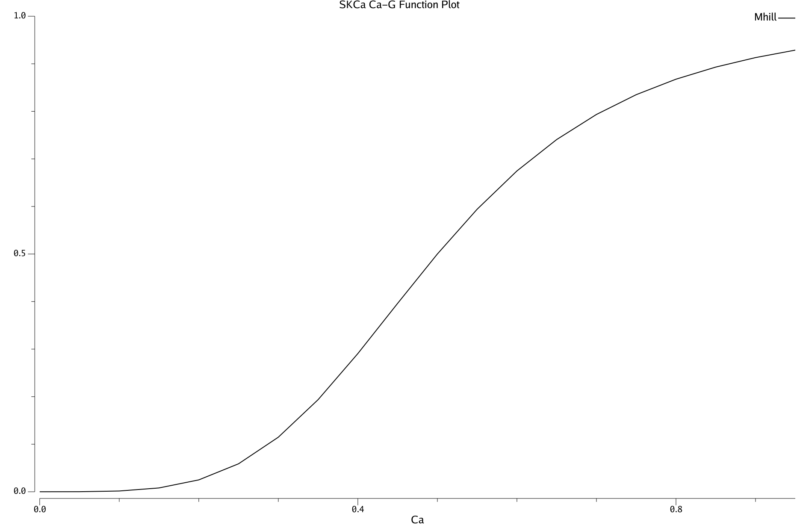
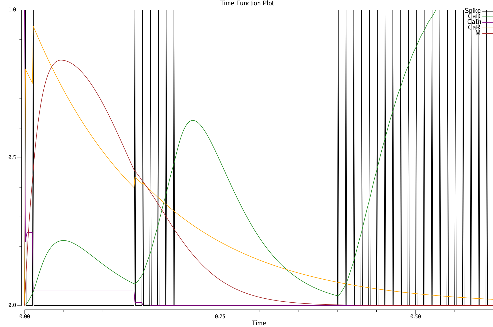

# Channel Plots

## A-type Potassium Channel

This voltage-gated K channel, found especially on dendrites of pyramidal neurons for example, has a narrow window of activation between the M and H gates, around -37 mV.  The M activating gate has a fast time constant on the scale of a msec, while the H inactivating gate has a linearly increasing time constant as a function of V.

It is particularly important for counteracting the excitatory effects of voltage gated calcium channels which can otherwise drive runaway excitatory currents.

```Go
	K = -1.8 - 1/(1+exp((vbio+40)/5))
```

```Go
    Alpha(V,K) = exp(0.03707 * K * (V - 1))
```

```Go
	Beta(V,K) = exp(0.01446 * K * (V - 1))
```

```Go
    H(V) = 1 / (1 + epx(0.1133 * (V + 56)))
```

```Go
    Htau(V) = 0.26 * (V + 50) > 2
```

```Go
    M(Alpha) = 1 / (1 + Alpha)
```

```Go
    Mtau(Alpha, Beta) = 1 + Beta / (0.5 * (1 + Alpha))
```

NOTE: to work properly with 1 msec Dt updating, the MTau adds a 1 -- otherwise MTau goes to high.

")

")

")

")


The `Time Run` plot (above) shows how the Gak current develops over time in response to spiking, which it tracks directly due to very fast M dynamics.  The H current inactivates significantly when the consistent Vm level (TimeVstart) is elevated -- e.g., -50 as shown in the figure.

### Simplified AKs channel

The `AKsParams` provides a much simpler, stateless version of the AK channel that is useful to just get a high-level cutoff to membrane potentials in the dendrites, e.g., as might otherwise emerge from the VGCC channel.


This function is:
```Go
	if vbio > -37 { // flat response above cutoff -- real function goes back down..
		vbio = -37
	}
	return 0.076 / (1.0 + math32.FastExp(-0.075*(vbio+2)))
```

## GABA-B

Explores the GABA-B dynamics from Sanders et al (2013) and Thomson & Destexhe, 1999.

GABA-B is an inhibitory channel activated by the usual GABA inhibitory neurotransmitter, which is coupled to the GIRK *G-protein coupled inwardly rectifying potassium (K) channel*.  It is ubiquitous in the brain, and is likely essential for basic neural function (especially in spiking networks from a computational perspective).  The inward rectification is caused by a Mg+ ion block *from the inside* of the neuron, which means that these channels are most open when the neuron is hyperpolarized (inactive), and thus it serves to *keep inactive neurons inactive*.

Based on Fig 15 of TD99, using a double-exponential function with 60 msec time to peak, and roughly 200 msec time to return to baseline, along with sigmoidal function of spiking for peak conductance, and the Mg inverse rectification curve.

Double exponential can't quite fit the right time-course, but 45 rise and 50 decay gives pretty reasonable looking overall distribution with peak at 47, and about .2 left after 200 msec. 35 / 40 has peak around 37 and .1 left after 100.

## kIR potassium inward rectifying channel


## M-type voltage gated potassium channel: mAHP

This voltage-gated K channel, which is also inactivated by ACh muscarinic receptor activation, plays a role in medium time-scale afterhyperpolarization (mAHP).

Original formulation due to Mainen & Sejnowski (1996) is widely used, and used here.

```Go
	vo = (V - Voff)
	a = 0.001 * vo / (1 - exp(-vo/Vslope))
	b = -0.001 * vo / (1 - exp(vo/Vslope))

   tau = 1 / (a + b)
   ninf = a / (a + b)
```

")

")

")

The `Time Run` plot (above) shows how the mAHP current develops over time in response to spiking, in comparison to the KNa function, with the default "fast" parameters of 50msec and rise = 0.05.  The mAHP is much more "anticipatory" due to the direct V sensitivity, whereas KNa is much more "reactive", responding only the Na after spiking.

## NMDA

This plots the NMDA current function from Sanders et al, 2013 and Brunel & Wang (2001) (BW01), which is the most widely used active maintenance model.

See also: https://brian2.readthedocs.io/en/stable/examples/frompapers.Brunel_Wang_2001.html

Also used in: WeiWangWang12, FurmanWang08, NassarHelmersFrank18

Voltage dependence function based on Mg ion blocking is:

```Go
1 / (1 + (C/3.57)*exp(-0.062 * vm))
```

Jahr & Stevens (1990) originally derived this equation, using a Mg+ concentration C of 1 mM, so that factor = 0.28, used in BW01.  Urakubo et al. (2008) used a concentration of 1.5 mM, citing Froemke & Dan (2002).  Various other sources (Vink & Nechifor) indicate physiological ranges being around 1.2 - 1.4.  


In addition to this v-dependent Mg factor, conductance depends on presynaptic glutamate release, which in the basic BW01 model just increments with spikes and decays with a time constant of about 100 msec.

The Urakubo et al (2008) model introduces allosteric dynamics, based on data from Froemke & Dan (2002), which we can capture simply using an inhibitory factor that increments with each spike and decays with a 100 msec time constant.  However, their model has an effective Glu-binding decay time of only 30 msec.

## slow AHP (sAHP): Calcium 

This channel is driven by a M-type mechanism operating on calcium sensor pathways that have longer time constants, updated at the theta cycle level so that guarantees a long baseline already.  The logistic gating function operates with a high cutoff on the underlying Ca signal

The logistic operates on integrated Ca:

```Go
	co = (ca - Off)
	a = co / TauMax * (1 - exp(-co/Slope))
	b = -co / TauMax * (1 - exp(co/Slope))

   tau = 1 / (a + b)
   ninf = a / (a + b)
```

")

")

")

The `Time Run` plot (above) shows how the mAHP current develops over time in response to spiking, in comparison to the KNa function, with the default "fast" parameters of 50msec and rise = 0.05.  The mAHP is much more "anticipatory" due to the direct V sensitivity, whereas KNa is much more "reactive", responding only the Na after spiking.

## sKCa: Voltage-gated Calcium Channels

This plots the sKCa current function, which describes the small-conductance calcium-activated potassium channel, using the equations described in Fujita et al (2012) based on Gunay et al (2008), (also Muddapu & Chakravarthy, 2021).  There is a gating factor M that depends on the Ca concentration, modeled using an X / (X + C50) form Hill equation:

```Go
M_hill(ca) = ca^h / (ca^h + c50^h)
```

This function is .5 when `ca == c50`, and the `h` default power (`Hill` param) of 4 makes it a sharply nonlinear function.

SKCa can be activated by intracellular stores in a way that drives pauses in firing, and can require inactivity to recharge the Ca available for release. These intracellular stores can release quickly, have a slow decay once released, and the stores can take a while to rebuild, leading to rapidly triggered, long-lasting pauses that don't recur until stores have rebuilt, which is the observed pattern of firing of STNp pausing neurons, that open up a window for BG gating.

`CaIn` = intracellular stores available for release; `CaR` = released amount from stores;  `CaM` = K channel conductance gating factor driven by CaR binding.

```Go
	CaR -= CaR * CaRDecayDt
	if spike {
		CaR += CaIn * KCaR
	}
	if CaD < CaInThr {
		CaIn += CaInDt * (1 - CaIn)
	}
```



**Figure 1:** M gating as a function of Ca, using Hill function with exponent 4, C50 = .5.



**Figure 2:** Time plot showing pausing and lack of recovery.  The spiking input to the neuron is toggled every 200 msec (theta cycle), with 3 cycles shown.  The CaIn level does not recover during the off phase -- 2 or more such phases are required.

## VGCC: Voltage-gated Calcium Channels

This plots the VGCC current function, which is an L-type Ca channel that opens as a function of membrane potential.  It tends to broaden the effect of action potential spikes in the dendrites.

```Go
G(vm) = -vm / (1 - exp(0.0756 * vm))
```

```Go
M(vm) = 1 / (1 + exp(-(vm + 37)))     // Tau = 3.6 msec
```

```Go
H(vm) = 1 / (1 + exp((vm + 41) * 2))  // Tau = 29 msec
```

```Go
VGCC(vm) = M^3 H * G(vm)
```

")

The intersection of M and H produces a very narrow membrane potential window centered around -40 mV where the gates are both activated, with the fast updating (3.6 msec tau) and cubic dependence on M essentially shutting off the current very quickly when the action potential goes away.  The longer H time constant provides a slow adaptation-like dynamic that is sensitive to frequency (more adaptation at higher frequencies).


The `Time Run` plot (above) shows these dynamics playing out with a sequence of spiking.

Functionally, the narrow voltage window restricts the significance of this channel to the peri-spiking time window, where the Ca++ influx provides a bit of extra sustain on the trailing edge of the spike.  More importantly, the Ca++ provides a postsynaptic-only spiking signal for learning.

# References

* Jahr, C. E., & Stevens, C. F. (1990). A quantitative description of NMDA receptor-channel kinetic behavior. Journal of Neuroscience, 10(6), 1830–1837. https://doi.org/10.1523/JNEUROSCI.10-06-01830.1990

* Sanders, H., Berends, M., Major, G., Goldman, M. S., & Lisman, J. E. (2013). NMDA and GABAB (KIR) Conductances: The "Perfect Couple" for Bistability. Journal of Neuroscience, 33(2), 424–429. https://doi.org/10.1523/JNEUROSCI.1854-12.2013

* Thomson AM, Destexhe A (1999) Dual intracellular recordings and computational models of slow inhibitory postsynaptic potentials in rat neocortical and hippocampal slices. Neuroscience 92:1193–1215.

* Vink, R., & Nechifor, M. (Eds.). (2011). Magnesium in the Central Nervous System. University of Adelaide Press. https://doi.org/10.1017/UPO9780987073051

* Urakubo, H., Honda, M., Froemke, R. C., & Kuroda, S. (2008). Requirement of an allosteric kinetics of NMDA receptors for spike timing-dependent plasticity. *The Journal of Neuroscience, 28(13),* 3310–3323. http://www.ncbi.nlm.nih.gov/pubmed/18367598

