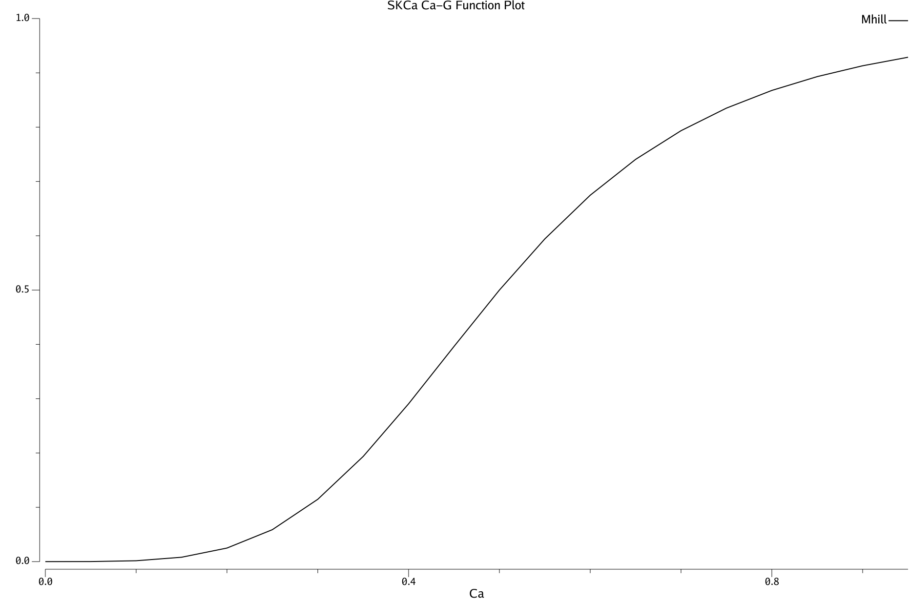
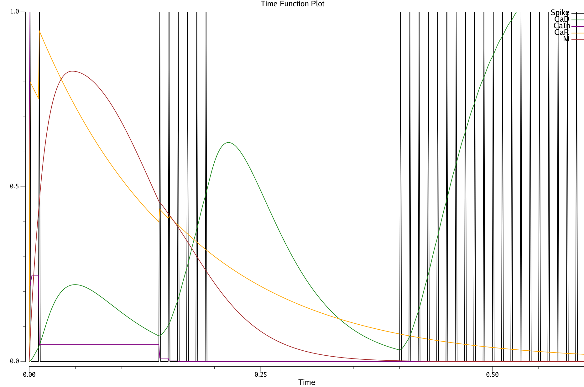

# sKCa: Voltage-gated Calcium Channels

This plots the sKCa current function, which is describes the small-conductance calcium-activated potassium channel, using the equations described in Fujita et al (2012) based on Gunay et al (2008), (also Muddapu & Chakravarthy, 2021).  There is a gating factor M that depends on the Ca concentration, modeled using an X / (X + C50) form Hill equation:

```Go
M_hill(ca) = ca^h / (ca^h + c50^h)
```

This function is .5 when `ca == c50`, and the `h` default power (`Hill` param) of 4 makes it a sharply nonlinear function.

SKCa can be activated by intracellular stores in a way that drives pauses in firing, and can require inactivity to recharge the Ca available for release. These intracellular stores can release quickly, have a slow decay once released, and the stores can take a while to rebuild, leading to rapidly triggered, long-lasting pauses that don't recur until stores have rebuilt, which is the observed pattern of firing of STNp pausing neurons, that open up a window for BG gating.

`CaIn` = intracellular stores available for release; `CaR` = released amount from stores;  `CaM` = K channel conductance gating factor driven by CaR binding.

```Go
	CaR -= CaR * CaRDecayDt
	if spike {
		CaR += CaIn * KCaR
	}
	if CaD < CaInThr {
		CaIn += CaInDt * (1 - CaIn)
	}
```



**Figure 1:** M gating as a function of Ca, using Hill function with exponent 4, C50 = .5.



**Figure 2:** Time plot showing pausing and lack of recovery.  The spiking input to the neuron is toggled every 200 msec (theta cycle), with 3 cycles shown.  The CaIn level does not recover during the off phase -- 2 or more such phases are required.


