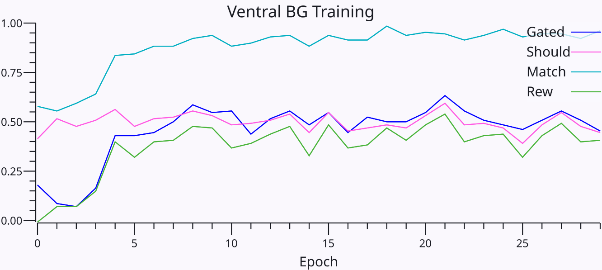

# BG Ventral

This is a test of the [pcore](../../PCORE_BG.md) model of basal ganglia (BG) function, in the **Ventral Striatum** (VS).  See [bgdorsal](../bgdorsal) for the Dorsal Striatum (DS) model, which is optimized for motor control via PFC gating and descending disinhibitory modulation.

This test model has all of the standard PFC layers, which are kept busy by predicting a sequence of input values on the `In` layer, via the [deep](../../DEEP.md) predictive learning mechanism (`InP` is the pulvinar layer representing the prediction of `In`).  This prediction task is completely orthogonal from the gating decision made by the BG, which is driven by the `ACCPos` and `ACCNeg` layers.

These `ACC` layers have `PopCode` representations of values, and the BG gating is trained to gate when Pos > Neg.  Typically you do `TrainRun` or `Step` with the step set to `Run`, and then `TestRun` which will run through all combinations of `ACCPos` (outer loop) and `ACCNeg` (inner loop), with 25 samples of each value to get statistics (it takes a while).  Click on `TestTrialStats Plot` to see the results -- you can click on `ACCPos` and `ACCNeg` to see those inputs, and then compare `Gated` with `Should` to see how the network performed.

# results

Training data shows close match between Gated and Should (high Match proportion).

Testing data over ACC Pos (outer loop) and ACC Neg (inner loop) (see fig below) shows increasing probability of gating as Pos increases, and reduced firing, and slower RT, as Neg increases, closely matching the target `Should` behavior.  25 samples of each case are performed, so intermediate levels indicate probability of gating.  Model shows appropriate probabilistic behavior on the marginal cases.

